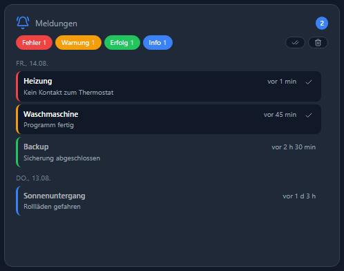
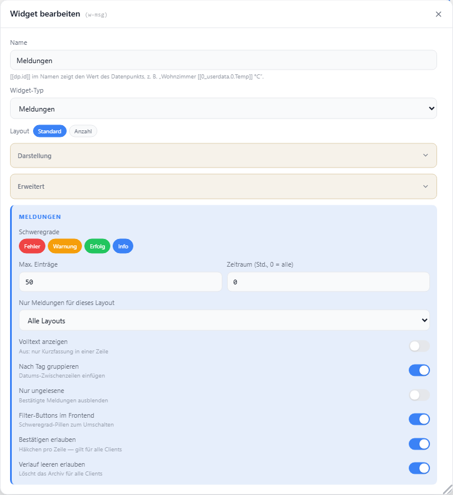

# Meldungen

Verlauf der eingegangenen Informationen, Warnungen und Fehler. Klick auf eine Zeile öffnet die Detailansicht, das Häkchen bestätigt den Eintrag — geräteübergreifend.

Wie Meldungen ins System kommen: [Einstellungen → Meldungen](../einstellungen/meldungen).

Braucht keinen Datenpunkt.

## Einstellungen

Alle Optionen werden im Editor unter **Widget bearbeiten** gesetzt.

### Anzeige

| Option | Standard | |
| --- | --- | --- |
| `showTitle` | `true` | Titel anzeigen |
| `showIcon` | `true` | Icon anzeigen |
| `icon` | `BellRing` | [Lucide-Icon](https://lucide.dev) |
| `iconSize` | `20` | px |
| `titleAlign` | `left` | `left` · `center` · `right` |
| `detailed` | `false` | Volltext statt einzeiliger Kurzfassung |
| `groupByDay` | `false` | Datums-Zwischenzeilen einfügen |

### Filter

| Option | Standard | |
| --- | --- | --- |
| `severities` | alle | vorausgewählte Schweregrade (`error` · `warning` · `success` · `info`) |
| `maxEntries` | `50` | maximal angezeigte Einträge |
| `hours` | `0` | Zeitraum in Stunden; `0` = alle |
| `unreadOnly` | `false` | bestätigte Meldungen ausblenden |
| `layoutFilter` | — | nur Meldungen, die an dieses Layout gerichtet sind |
| `showFilter` | `true` | Schweregrad-Pillen im Frontend anzeigen |

Die Pillen filtern nur die Ansicht — mindestens eine bleibt immer aktiv.

### Aktionen

| Option | Standard | |
| --- | --- | --- |
| `showAck` | `true` | Häkchen zum Bestätigen pro Zeile |
| `allowClear` | `false` | Papierkorb-Button; leert den Verlauf für alle Geräte |

## Layouts

| Layout | |
| --- | --- |
| `default` | Liste mit Filter-Pillen, Zeitstempel und Bestätigen |
| `count` | nur die Zahl: unbestätigt / gesamt |

::: tip Zähler ohne Widget
Für einen reinen Zähler an einer Widget-Ecke genügt ein [Badge](../einstellungen/editor#badges) vom Typ „Anzahl" auf `aura.0.messages.unreadCount`.
:::
