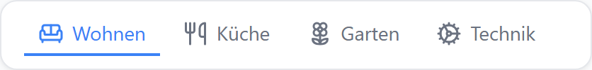
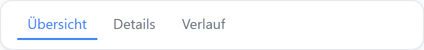
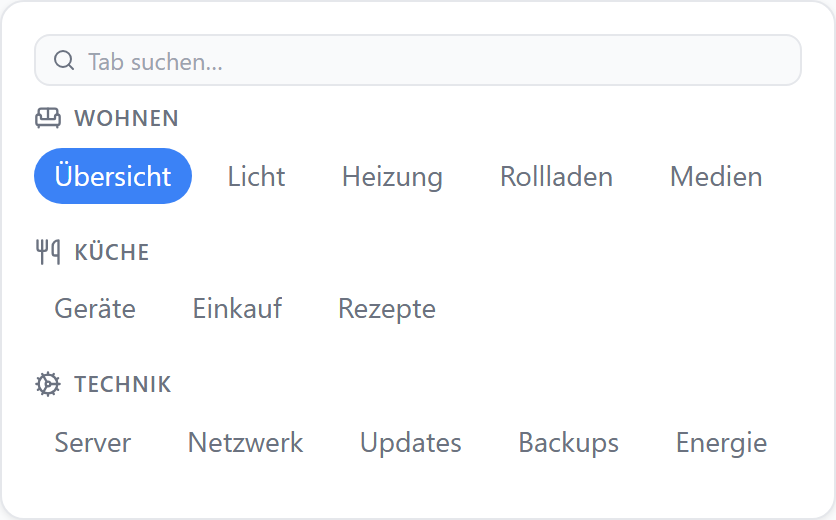
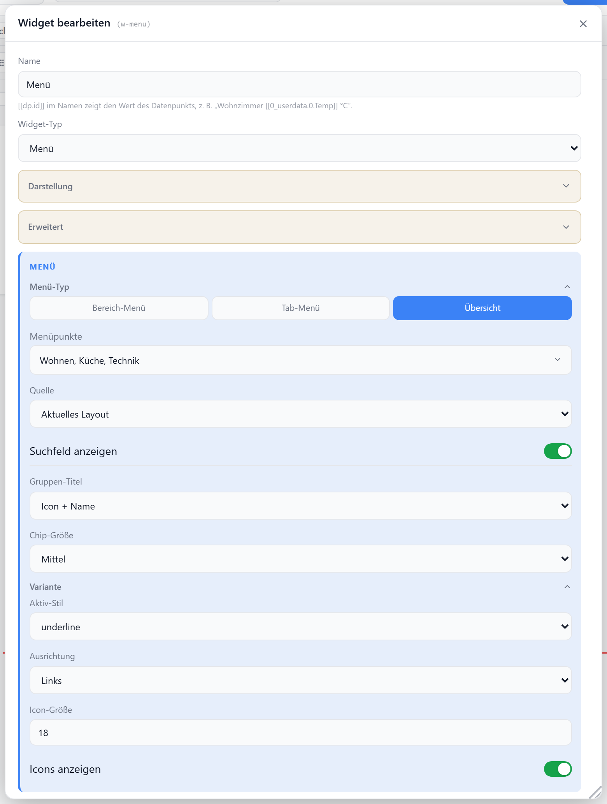
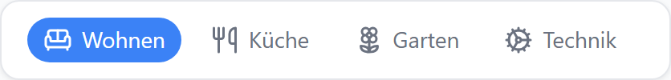
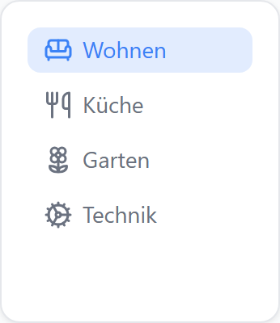
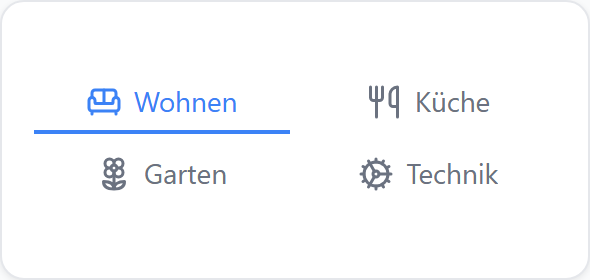
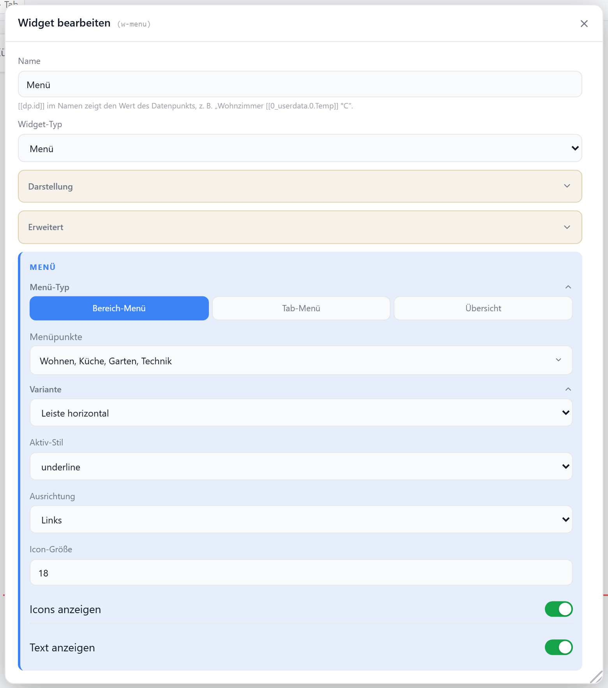

# Menü

Frei positionierbares Navigations-Menü — zeigt die Bereiche des Layouts, die Tabs des Bereichs oder eine Übersicht aller Bereiche mit ihren Tabs zum direkten Umschalten.

## Datenpunkt

Keiner. Die Einträge, ihre Namen und Icons stammen aus dem Layout ([Layouts](../einstellungen/layouts)).

## Menü-Typ

| `menuMode` | Einträge | Klick springt auf |
| --- | --- | --- |
| `section` | Bereiche des Layouts | `/view/<layout>/s/<bereich>` |
| `tab` | Tabs des aktuellen Bereichs | `/view/…/tab/<tab>` |
| `overview` | alle Bereiche des Layouts als Gruppen, darunter ihre Tabs als Chips | `/view/<layout>/s/<bereich>/tab/<tab>` |

Tab-Menü (`menuMode: tab`):

Übersicht (`menuMode: overview`) mit Suchfeld:

Als `hidden` markierte Bereiche und Tabs erscheinen nie. Ein Wechsel des Menü-Typs setzt die Auswahl der Menüpunkte zurück.

### Übersicht (`overview`)

Baut sich aus dem Layout selbst — umbenannte, verschobene oder neue Tabs sind sofort drin.

| Option | Standard | |
| --- | --- | --- |
| `menuSource` | `layout` | `layout` (aktuelles Layout) · `all` (alle Layouts, Layout-Name als Überschrift) |
| `showSearch` | `false` | Suchfeld über den Gruppen — filtert live nach Tab- oder Bereichsname, leere Gruppen verschwinden |
| `groupTitle` | `iconName` | `iconName` (Icon + Name) · `name` (nur Name) · `none` (aus) |
| `chipSize` | `md` | `sm` · `md` · `lg` |
| `hiddenItems` | `[]` | abgewählte **Bereiche** — die ganze Gruppe entfällt |

`variant`, `gridCols` und `showLabels` wirken hier nicht; `indicatorStyle` ist ohne Angabe `pills`. Der Inhalt scrollt im Widget, wenn die Chips nicht in die Höhe passen.

## Varianten

### Leiste horizontal (`hbar`)

Eine Zeile, horizontal scrollbar — Standard.

### Chips (`pills`)

Umbrechende Chip-Leiste, erzwingt den Aktiv-Stil `pills`.

### Liste vertikal (`vlist`)

Einträge untereinander, vertikal scrollbar.

### Raster (`grid`)

Feste Spaltenzahl über `gridCols`.

## Einstellungen

Alle Optionen werden im Editor unter **Widget bearbeiten** gesetzt.

### Menü-Typ

| Option | Standard | |
| --- | --- | --- |
| `menuMode` | `section` | `section` (Bereich-Menü) · `tab` (Tab-Menü) · `overview` (Übersicht) |
| `hiddenItems` | `[]` | abgewählte Einträge; im Dialog werden die **sichtbaren** Menüpunkte gewählt (bei `overview`: Bereiche) |

### Variante

| Option | Standard | |
| --- | --- | --- |
| `variant` | `hbar` | `hbar` · `pills` · `vlist` · `grid` |
| `indicatorStyle` | `underline` | Aktiv-Stil: `text` · `underline` · `filled` · `pills` |
| `align` | `start` | `start` · `center` · `end` — wirkt bei `hbar` und `pills` |
| `gridCols` | `3` | Spalten (1–12), nur bei `variant: grid` |
| `gap` | `6` | Abstand zwischen den Einträgen in px |
| `iconSize` | `18` | px (8–64) |
| `showIcons` | `true` | Icons anzeigen — Bereiche ohne eigenes Icon zeigen ein Standard-Icon, Tabs ohne Icon nur Text |
| `showLabels` | `true` | Text anzeigen |

## Verhalten

| | |
| --- | --- |
| Aktiver Eintrag | Bereich bzw. Tab der aktuell angezeigten Ansicht |
| Deaktivierte Tabs | ausgegraut, kein Klick |
| Keine Einträge übrig | Hinweis „Keine Menüpunkte"; Suche ohne Treffer: „Keine Treffer" |
| Editor & Admin-Bereich | Vorschau, Klicks navigieren nicht |
| Rahmen | ohne Titelzeile; im Editor liegen die Werkzeuge oben rechts |

Für eine Überschrift über dem Menü den [Abschnittstitel](./abschnittstitel) verwenden.
