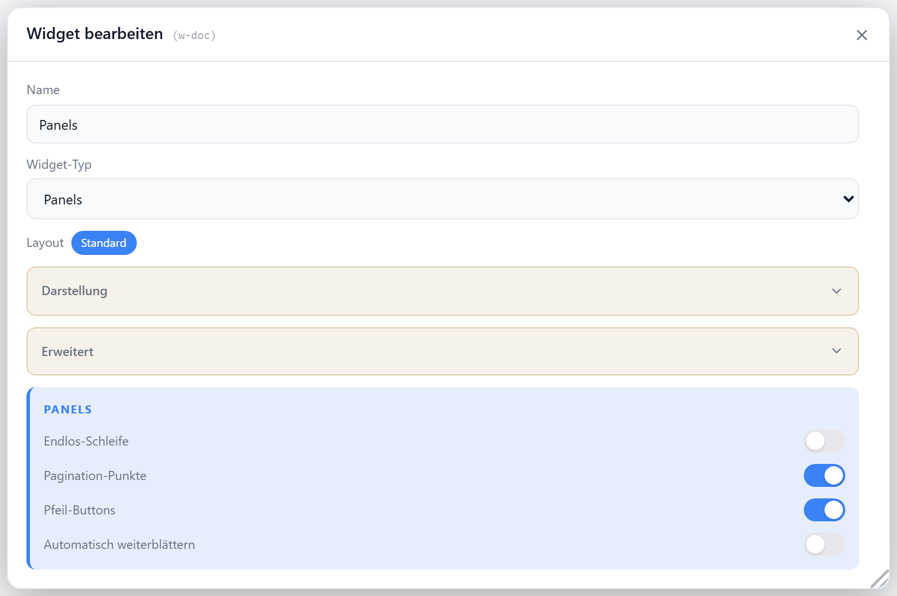

# Panels

Zeigt mehrere Widgets als horizontal swipebare Slides — pro Slide ein Widget in voller Größe. Navigation per Wischen (Touch oder Maus-Drag), Pagination-Punkten und Pfeil-Buttons. Slides werden im Editor hinzugefügt (Auswahl-Liste oder per Drag-and-Drop). Optional Endlos-Schleife und Autoplay.

## Einstellungen

Alle Optionen werden im Editor unter **Widget bearbeiten** gesetzt.

### Anzeige

| Option | Standard | |
| --- | --- | --- |
| `showTitle` | `true` | Titel anzeigen |
| `showIcon` | `true` | Icon anzeigen |
| `icon` | `GalleryThumbnails` | [Lucide-Icon](https://lucide.dev) |
| `iconSize` | `20` | px |
| `titleAlign` | `left` | `left` · `center` · `right` |
| `transparent` | `false` | Rahmen/Trennlinie ausblenden |

### Navigation

| Option | Standard | |
| --- | --- | --- |
| `showDots` | `true` | Pagination-Punkte anzeigen |
| `showArrows` | `true` | Pfeil-Buttons anzeigen |
| `loop` | `false` | Endlos-Schleife (vom letzten zum ersten Slide) |

### Autoplay

| Option | Standard | |
| --- | --- | --- |
| `autoplay` | `false` | automatisch weiterblättern (ab 2 Slides) |
| `autoplayInterval` | `5` | s zwischen den Slides (min. `1`) |
