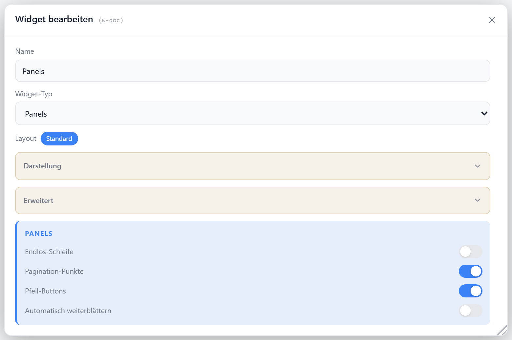

# Panels

Zeigt mehrere Widgets als horizontal swipebare Slides — pro Slide ein Widget in voller Größe. Navigation per Wischen (Touch oder Maus-Drag), Pagination-Punkten, Pfeil-Buttons oder Datenpunkt. Slides werden im Editor hinzugefügt (Auswahl-Liste oder per Drag-and-Drop). Optional Endlos-Schleife und Autoplay.

## Einstellungen

Alle Optionen werden im Editor unter **Widget bearbeiten** gesetzt.



### Anzeige

| Option | Standard | |
| --- | --- | --- |
| `showTitle` | `true` | Titel anzeigen |
| `showIcon` | `true` | Icon anzeigen |
| `icon` | `GalleryThumbnails` | [Lucide-Icon](https://lucide.dev) |
| `iconSize` | `20` | px |
| `titleAlign` | `left` | `left` · `center` · `right` |
| `transparent` | `false` | Rahmen/Trennlinie ausblenden |

### Navigation

| Option | Standard | |
| --- | --- | --- |
| `showDots` | `true` | Pagination-Punkte anzeigen |
| `showArrows` | `true` | Pfeil-Buttons anzeigen |
| `loop` | `false` | Endlos-Schleife — läuft nahtlos vom letzten zum ersten Slide weiter (und umgekehrt) |

### Steuerung per Datenpunkt

Jedes Panels-Widget legt beim Anlegen automatisch einen Steuer-Datenpunkt an:

```
aura.<instanz>.panels.<widget-id>.activeSlide
```

Der Pfad steht im Editor über dem Eingabefeld und lässt sich dort kopieren. Schreibt ein Button, Skript oder Schalter diesen Wert, springt das Widget auf den passenden Slide.

Die Slide-Namen stehen als `common.states` am Datenpunkt (`0` → erster Slide-Titel usw.) und werden bei jeder Änderung nachgeführt. Im [Auswahlfeld](./auswahlfeld.md)-Widget genügt damit **Aus common.states importieren** — der Nutzer wählt den Slide dann per Namen statt per Zahl. ioBroker zeigt am Datenpunkt aus demselben Grund ein Dropdown statt eines rohen Zahlenfelds.

| Option | Standard | |
| --- | --- | --- |
| `activeDp` | – | eigener Datenpunkt statt des automatischen |
| `activeDpBase` | `0` | Wert des ersten Slides — `0` oder `1` |
| `activeDpWrite` | `true` | Wischen, Punkte und Pfeile schreiben den Wert zurück |

Werte außerhalb des Bereichs und nicht-numerische Werte werden ignoriert — der Slide bleibt stehen. Boolean-DPs zählen als `0`/`1`, ein Schalter kann also zwischen zwei Slides umschalten. In Verbindung mit dem Spiegel-Widget lassen sich so bestehende Tab-Inhalte per Datenpunkt umschalten.

Wird ein Panels-Widget gelöscht, bleibt sein Datenpunkt zurück — **Admin → Dashboard** listet solche Waisen und räumt sie auf.

### Autoplay

| Option | Standard | |
| --- | --- | --- |
| `autoplay` | `false` | automatisch weiterblättern (ab 2 Slides) |
| `autoplayInterval` | `5` | s zwischen den Slides (min. `1`) |
