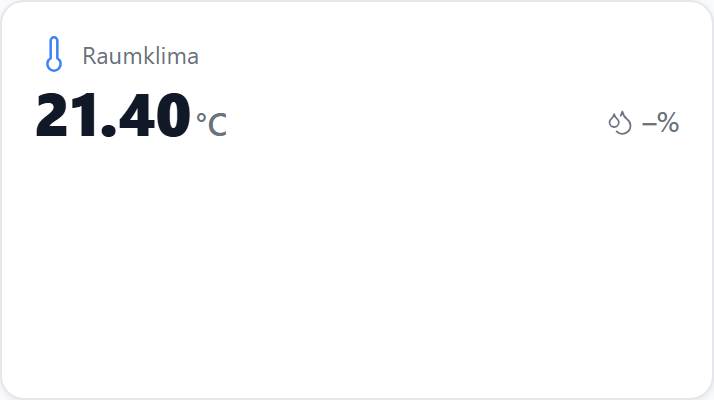
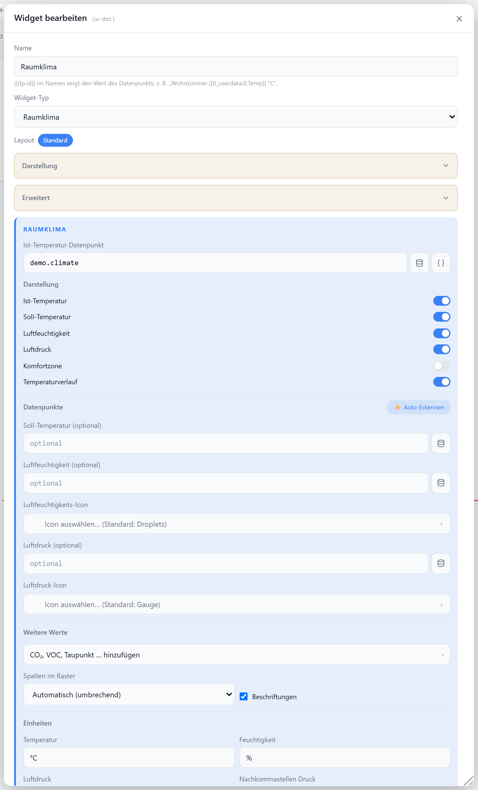

# Raumklima

Zeigt Temperatur, Luftfeuchtigkeit und einen optionalen Temperaturverlauf kombiniert an. Die Ist-Temperatur kommt aus dem Haupt-Datenpunkt, Soll-Temperatur, Feuchte und Luftdruck aus separaten DPs; der Verlauf wird aus einer History-Instanz geladen.

## Datenpunkt

| Feld | Pflicht | Typ | |
| --- | --- | --- | --- |
| `datapoint` | ja | `number` | Ist-Temperatur; liefert auch die Verlaufsdaten |
| `targetDatapoint` | nein | `number` | Soll-Temperatur (als Badge ↑) |
| `humidityDatapoint` | nein | `number` | Luftfeuchtigkeit |
| `pressureDatapoint` | nein | `number` | Luftdruck |

## Layouts

Das Widget hat ein einziges Layout: Titel/Icon oben, darunter Ist-Temperatur groß mit Soll-Wert, Feuchte und Luftdruck rechts, optionalem Komfort-Badge, Zeitraum-Auswahl und Verlaufsdiagramm.

## Einstellungen

Alle Optionen werden im Editor unter **Widget bearbeiten** gesetzt.

### Anzeige

| Option | Standard | |
| --- | --- | --- |
| `showTitle` | `true` | Titel anzeigen |
| `showIcon` | `true` | Temperatur-Icon anzeigen |
| `showActualTemp` | `true` | Ist-Temperatur anzeigen |
| `showTargetTemp` | `true` | Soll-Temperatur anzeigen (nur mit `targetDatapoint`) |
| `showHumidity` | `true` | Luftfeuchtigkeit anzeigen |
| `showPressure` | `true` | Luftdruck anzeigen (nur mit `pressureDatapoint`) |
| `showComfort` | `false` | Komfort-Badge (Temp 18–24 °C, Feuchte 40–60 %) |
| `icon` | `Thermometer` | [Lucide-Icon](https://lucide.dev) |
| `humidityIcon` | `Droplets` | Icon für die Feuchte |
| `pressureIcon` | `Gauge` | Icon für den Luftdruck |
| `iconSize` | `20` | px |
| `titleAlign` | `left` | `left` · `center` · `right` |

### Werte

| Option | Standard | |
| --- | --- | --- |
| `decimals` | global | Nachkommastellen für Temperatur und Feuchte |
| `unit` | `°C` | Einheit der Temperatur |
| `humidityUnit` | `%` | Einheit der Feuchte |
| `pressureUnit` | `hPa` | Einheit des Luftdrucks |
| `pressureDecimals` | `0` | Nachkommastellen des Luftdrucks |

### Verlauf

Das Diagramm erscheint nur, wenn `showChart` aktiv ist und eine `historyInstance` gesetzt wurde.

| Option | Standard | |
| --- | --- | --- |
| `showChart` | `true` | Verlaufsdiagramm anzeigen |
| `historyInstance` | — | History-Instanz, z. B. `history.0` |
| `historyRange` | `24h` | `1h` · `6h` · `24h` · `7d` · `30d` · `custom` |
| `historyRangeCustomValue` | `24` | Wert bei `custom` |
| `historyRangeCustomUnit` | `h` | `h` · `d` (bei `custom`) |
| `lockRange` | `false` | Zeitraum-Auswahl ausblenden |
| `lineColor` | `--accent` | Linien-/Flächenfarbe |

### Y-Achse & Durchschnitt

| Option | Standard | |
| --- | --- | --- |
| `showYAxis` | `false` | Y-Achse einblenden |
| `yAxisCompact` | `true` | kompakte Tick-Formatierung |
| `showGridLines` | `false` | horizontale Hilfslinien an den Y-Werten |
| `showAverage` | `false` | Durchschnittslinie im Diagramm |
| `showAverageAsValue` | `false` | Durchschnitt als Ø-Wert unter der Temperatur |
| `avgColor` | wie `lineColor` | Farbe von Linie/Wert |
