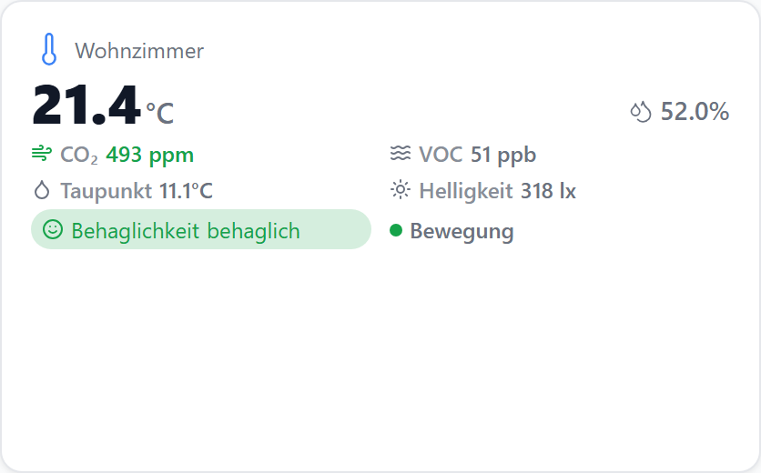
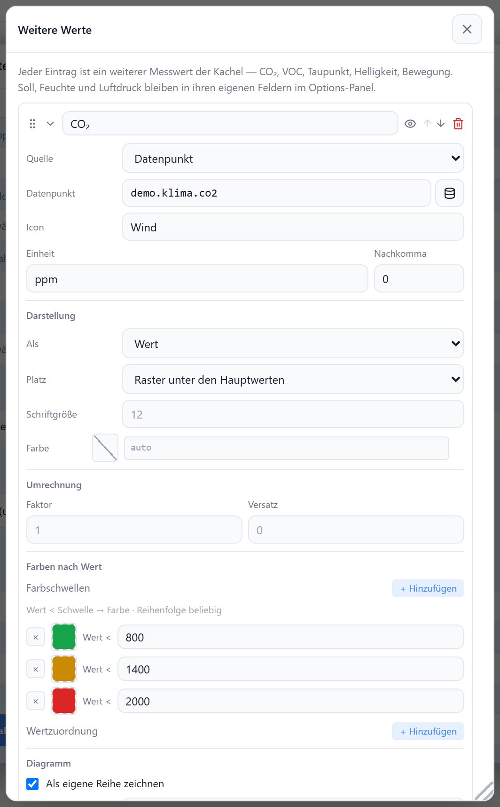

# Raumklima

Zeigt Temperatur, Luftfeuchtigkeit und einen optionalen Verlauf kombiniert an. Die Ist-Temperatur kommt aus dem Haupt-Datenpunkt, Soll-Temperatur, Feuchte und Luftdruck aus separaten DPs; der Verlauf wird aus einer History-Instanz geladen.

Jeder weitere Messwert des Sensors — CO₂, VOC, Taupunkt, Luftqualität, Helligkeit, Bewegung — ist ein Eintrag unter [Weitere Werte](#weitere-werte).

## Datenpunkt

| Feld | Pflicht | Typ | |
| --- | --- | --- | --- |
| `datapoint` | ja | `number` | Ist-Temperatur; liefert auch die Verlaufsdaten |
| `targetDatapoint` | nein | `number` | Soll-Temperatur (als Badge ↑) |
| `humidityDatapoint` | nein | `number` | Luftfeuchtigkeit |
| `pressureDatapoint` | nein | `number` | Luftdruck |

## Layouts

Das Widget hat ein einziges Layout: Titel/Icon oben, darunter Ist-Temperatur groß mit Soll-Wert, Feuchte und Luftdruck rechts, dem Raster der weiteren Werte, optionalem Komfort-Badge, Zeitraum-Auswahl und Verlaufsdiagramm.

## Einstellungen

Alle Optionen werden im Editor unter **Widget bearbeiten** gesetzt.

### Anzeige

| Option | Standard | |
| --- | --- | --- |
| `showTitle` | `true` | Titel anzeigen |
| `showIcon` | `true` | Temperatur-Icon anzeigen |
| `showActualTemp` | `true` | Ist-Temperatur anzeigen |
| `showTargetTemp` | `true` | Soll-Temperatur anzeigen (nur mit `targetDatapoint`) |
| `showHumidity` | `true` | Luftfeuchtigkeit anzeigen |
| `showPressure` | `true` | Luftdruck anzeigen (nur mit `pressureDatapoint`) |
| `showComfort` | `false` | Komfort-Badge (Temp 18–24 °C, Feuchte 40–60 %) |
| `icon` | `Thermometer` | [Lucide-Icon](https://lucide.dev) |
| `humidityIcon` | `Droplets` | Icon für die Feuchte |
| `pressureIcon` | `Gauge` | Icon für den Luftdruck |
| `iconSize` | `20` | px |
| `titleAlign` | `left` | `left` · `center` · `right` |

### Werte

| Option | Standard | |
| --- | --- | --- |
| `decimals` | global | Nachkommastellen für Temperatur und Feuchte |
| `unit` | `°C` | Einheit der Temperatur |
| `humidityUnit` | `%` | Einheit der Feuchte |
| `pressureUnit` | `hPa` | Einheit des Luftdrucks |
| `pressureDecimals` | `0` | Nachkommastellen des Luftdrucks |

### Verlauf

Das Diagramm erscheint nur, wenn `showChart` aktiv ist und eine `historyInstance` gesetzt wurde.

| Option | Standard | |
| --- | --- | --- |
| `showChart` | `true` | Verlaufsdiagramm anzeigen |
| `historyInstance` | — | History-Instanz, z. B. `history.0` |
| `historyRange` | `24h` | `1h` · `6h` · `24h` · `7d` · `30d` · `custom` |
| `historyRangeCustomValue` | `24` | Wert bei `custom` |
| `historyRangeCustomUnit` | `h` | `h` · `d` (bei `custom`) |
| `lockRange` | `false` | Zeitraum-Auswahl ausblenden |
| `lineColor` | `--accent` | Linien-/Flächenfarbe der Temperatur |
| `showChartLegend` | `true` | Legende, sobald eine zweite Reihe gezeichnet wird |

Neben der Temperatur zeichnet das Diagramm jeden weiteren Wert mit `inChart`. Ein Wert in einer anderen Größenordnung gehört auf `chartAxis: right` — sonst drückt er die Temperaturkurve platt. Gerechnete Werte (Taupunkt, absolute Feuchte, Behaglichkeit) haben keinen Verlauf.

### Y-Achse & Durchschnitt

| Option | Standard | |
| --- | --- | --- |
| `showYAxis` | `false` | Y-Achse einblenden |
| `yAxisCompact` | `true` | kompakte Tick-Formatierung |
| `showGridLines` | `false` | horizontale Hilfslinien an den Y-Werten |
| `showAverage` | `false` | Durchschnittslinie im Diagramm |
| `showAverageAsValue` | `false` | Durchschnitt als Ø-Wert unter der Temperatur |
| `avgColor` | wie `lineColor` | Farbe von Linie/Wert |

## Weitere Werte

**Widget bearbeiten → Weitere Werte → Werte bearbeiten…** öffnet die Liste. Jeder Eintrag bringt Datenpunkt, Beschriftung, Einheit, Farben und Diagramm-Reihe selbst mit — ein neuer Messwert braucht keine neue Option.

### Vorlagen

| Vorlage | Einheit | |
| --- | --- | --- |
| CO₂ | `ppm` | Ampel ab 800 / 1400 / 2000 |
| CO₂-VOC (eCO₂) | `ppm` | aus dem VOC-Wert gerechnetes Äquivalent |
| VOC | `ppb` | Ampel ab 100 / 300 / 500 |
| Taupunkt | `°C` | gerechnet, kein Datenpunkt nötig |
| Absolute Feuchte | `g/m³` | gerechnet, kein Datenpunkt nötig |
| Behaglichkeit | — | gerechnet oder DP; 0 unbehaglich · 1 geht noch · 2 behaglich |
| Luftqualität | — | Schulnote 1–6 als Text |
| Helligkeit | `lx` | |
| Bewegung | — | Punkt, leuchtet bei Präsenz |
| Lautstärke | `dB` | |
| Freier Wert | — | alles selbst einstellen |

**Auto-Erkennen** legt für jeden passend benannten Geschwister-Datenpunkt einen fertigen Eintrag an.

### Felder eines Eintrags

| Feld | Standard | |
| --- | --- | --- |
| `id` | — | eindeutig im Widget; auch der Schlüssel der Diagramm-Reihe |
| `source` | `datapoint` | `datapoint` · `dewpoint` · `absoluteHumidity` · `comfort` |
| `datapoint` | — | nur bei `source: datapoint` |
| `label` | — | Beschriftung vor dem Wert |
| `icon` | — | [Lucide-Icon](https://lucide.dev) |
| `unit` | — | `%` und `°` hängen an der Zahl, alles andere mit Abstand |
| `decimals` | wie `decimals` | Nachkommastellen |
| `display` | `value` | `value` · `badge` · `dot` · `text` |
| `slot` | `grid` | `grid` Raster darunter · `secondary` rechte Spalte · `primary` groß neben der Temperatur |
| `fontSize` | je Platz | px |
| `color` | — | Theme-Token, z. B. `var(--accent-green)` |
| `thresholds` | — | `[Obergrenze, Farbe]` — erste Grenze, die der Wert unterschreitet |
| `valueMap` | — | Zahl → Text; sticht `thresholds` und lässt die Einheit weg |
| `valueFactor` / `valueOffset` | `1` / `0` | Anzeige = Rohwert × Faktor + Versatz |
| `inChart` | `false` | als eigene Reihe zeichnen (nur `source: datapoint`) |
| `chartAxis` | `left` | `right` für eine andere Größenordnung |
| `chartType` | `line` | `line` · `area` |
| `historyInstance` | wie das Widget | History-Instanz nur für diese Reihe |
| `hidden` | `false` | ausblenden, ohne zu löschen |

### Raster

| Option | Standard | |
| --- | --- | --- |
| `metricColumns` | `0` | Spalten; `0` = umbrechende Reihe |
| `showMetricLabels` | `true` | `label` vor dem Wert anzeigen |
