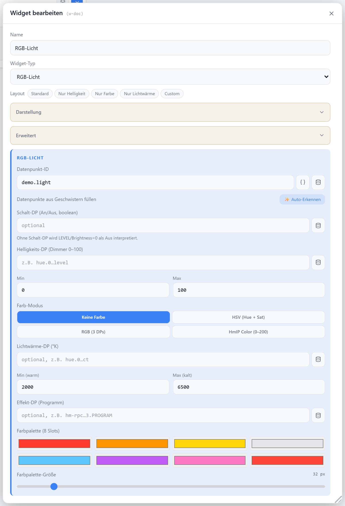

# RGB-Licht

Steuert Helligkeit, Farbe, Lichtwärme und Effekte einer Lampe in einem Widget. Unterstützt HSV-, RGB- und HmIP-Color-Datenpunkte. Die Steuerelemente werden über eine Tab-Leiste umgeschaltet; eine optionale Preset-Palette bietet Schnellzugriff auf Farben.

## Datenpunkt

Je nach Funktion werden verschiedene Datenpunkte verwendet. `colorMode` bestimmt, welche Farb-DPs ausgewertet werden.

| Feld | Pflicht | Typ | |
| --- | --- | --- | --- |
| `brightnessDp` | nein | `number` | Helligkeit; Fallback auf `datapoint` |
| `switchDp` | nein | `boolean` | separater An/Aus-DP; ohne ihn schaltet die Helligkeit auf `min` / `max` |
| `hueDp` / `saturationDp` | nein | `number` | bei `colorMode: hsv` |
| `rDp` / `gDp` / `bDp` | nein | `number` | bei `colorMode: rgb` |
| `colorDp` | nein | `number` | einzelner HmIP-Color-Integer bei `colorMode: hm-color` |
| `temperatureDp` | nein | `number` | Farbtemperatur in Kelvin |
| `effectDp` | nein | — | Effekt-Auswahl |

## Layouts

### light-all
Alle verfügbaren Tabs (Helligkeit, Farbe, Temperatur, Effekte) mit Power-Taste und Palette.

### light-brightness
Nur der Helligkeits-Tab.

### light-color
Nur der Farbrad-Tab.

### light-temperature
Nur der Farbtemperatur-Tab.

### Custom
Power, Helligkeit, Farbrad, Temperatur, Effekte, Palette, Titel, Status und Icon frei in einer Zellenmatrix platzieren — siehe [Custom-Layout](./custom-layout).

## Einstellungen

Alle Optionen werden im Editor unter **Widget bearbeiten** gesetzt.

### Anzeige

| Option | Standard | |
| --- | --- | --- |
| `showTitle` | `true` | Titel anzeigen |
| `showIcon` | `true` | Icon anzeigen |
| `showState` | `true` | Status-Text (An/Aus · %) anzeigen |
| `icon` | `Lightbulb` | [Lucide-Icon](https://lucide.dev) |
| `iconSize` | `20` | px |
| `titleAlign` | `left` | `left` · `center` · `right` |
| `statusAlign` | `left` | `left` · `center` · `right` |

### Farbe

| Option | Standard | |
| --- | --- | --- |
| `colorMode` | `none` | `none` · `hsv` · `rgb` · `hm-color` |
| `colorWheelStyle` | `disc` | `disc` (Scheibe) · `ring` (Ring) |
| `colorWheelSize` | `240` | max. px (80–400) |
| `showPalette` | `true` | Preset-Farbpalette anzeigen |
| `colorPresets` | 8 Standardfarben | Liste von Hex-Farben (max. 8) |
| `paletteSize` | `32` | px; oder `sm` (22) · `lg` (48) |

### Effekte

| Option | Standard | |
| --- | --- | --- |
| `effects` | — | Liste aus `{ value, label, color }` |

### Wertebereiche

| Option | Standard | |
| --- | --- | --- |
| `brightnessMin` | `0` | Helligkeits-Minimum |
| `brightnessMax` | `100` | Helligkeits-Maximum |
| `brightnessBarSize` | `220` | max. px des Balkens (60–400) |
| `satMax` | `100` | Maximum des Sättigungs-DPs (`hsv`) |
| `ctMin` | `2000` | min. Kelvin |
| `ctMax` | `6500` | max. Kelvin |
| `ctSliderSize` | `220` | max. px des Reglers (60–400) |
| `hmWhiteValue` | `200` | HmIP-Integer für Weiß-Modus (`hm-color`) |
| `powerButtonSize` | `120` | max. px der Power-Taste (40–240) |

### Status-Datenpunkte

Optionale Batterie- und Erreichbarkeits-DPs werden als kleine Badges eingeblendet (Abschnitt **Status-Datenpunkte** im Dialog).
