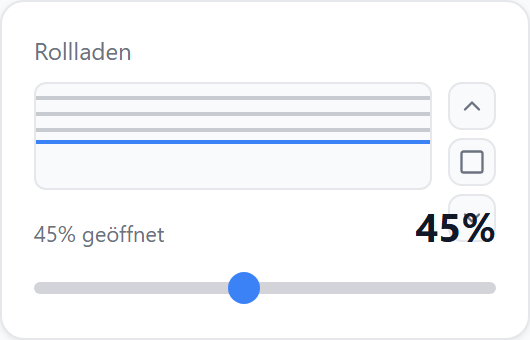
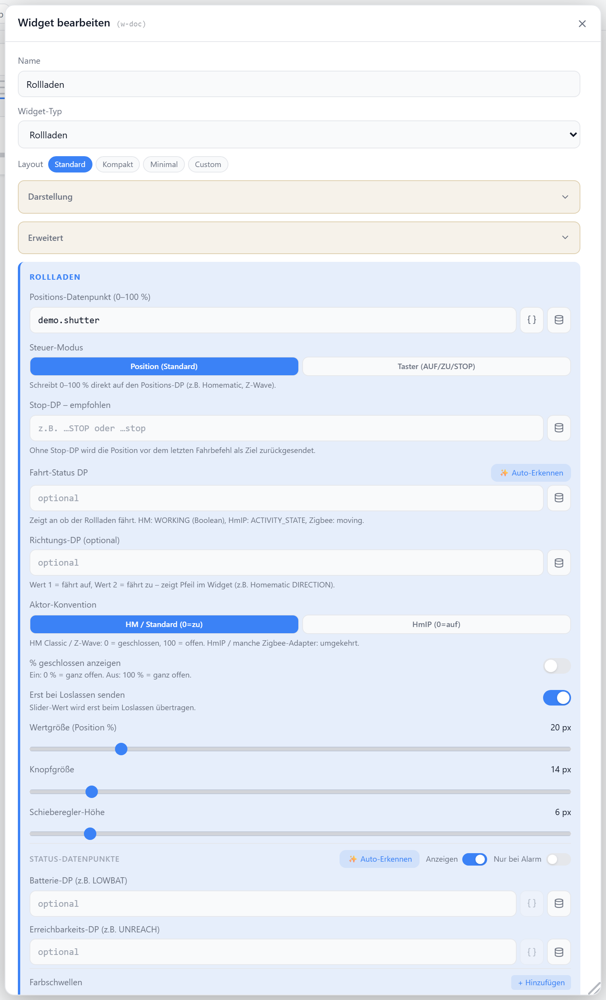

# Rollladen

Steuert und zeigt die Rollladen-Position (0–100 %) an. Auf-, Stop- und Ab-Tasten, optional ein Schieberegler, dazu eine grafische Lamellen-Darstellung und Fahr-Anzeige. Wahlweise Positions- oder Tasten-Modus.

## Datenpunkt

| Feld | Pflicht | Typ | |
| --- | --- | --- | --- |
| `datapoint` | ja | `number` | Position 0–100 %, `0` = geschlossen, `100` = offen — hierauf wird geschrieben |
| `actualPositionDp` | nein | `number` | separater Anzeige-DP für die tatsächliche Position (z. B. HmIP-BROLL: Kanal 3 = Status, Kanal 4 = steuerbar); wenn gesetzt speisen Anzeige, Schieberegler und Stopp-Ziel diesen Wert |
| `openDp` / `closeDp` | nein | `boolean` | Tasten-DPs für Auf/Ab (nur bei `controlMode: taster`) |
| `stopDp` | nein | `boolean` | separater Stop-DP; ohne ihn wird die aktuelle Position zurückgeschrieben |
| `activityDp` | nein | — | meldet, ob der Rollladen fährt |
| `directionDp` | nein | — | Fahrtrichtung (`1` = auf, `2` = ab) |
| `tiltDp` | nein | `number` | Lamellenwinkel für Jalousie/Raffstore (HmIP `LEVEL_2`, HM `LEVEL_SLATS`, Zigbee `tilt`); ohne ihn gibt es keinen Neigungs-Regler |
| `actualTiltDp` | nein | `number` | separater Anzeige-DP für die tatsächliche Neigung; geschrieben wird weiter auf `tiltDp` |

## Layouts

### Default
Titel/Icon oben, grafische Lamellen-Anzeige mit vertikaler Tastenreihe, darunter Status, Prozentwert und Schieberegler — für mittlere Zellen. Mit `tiltDp` steht der senkrechte Neigungs-Regler neben der Grafik (Seite über `tiltSliderSide`).

### Compact
Eine Zeile mit Icon, Titel, Prozentwert und Tastenreihe — für Listen mit vielen Rollläden. Neigung über die Lamellen-Taste (Popover) oder zwei Schrittasten.

### Minimal
Auf-Taste, Prozentwert und Stop/Ab-Tasten zentriert — für sehr kleine Zellen.

### Custom
Icon, Position, Status, Neigung und Auf-/Stop-/Ab-Tasten frei in einer Zellenmatrix platzieren — siehe [Custom-Layout](./custom-layout). Komponenten: `slider`, `tilt-slider-v`, `tilt-slider-h`, `btn-tilt`, `btn-tilt-open`, `btn-tilt-close`; Feld `tilt`.

## Einstellungen

Alle Optionen werden im Editor unter **Widget bearbeiten** gesetzt.

### Anzeige

| Option | Standard | |
| --- | --- | --- |
| `showTitle` | `true` | Titel anzeigen |
| `showIcon` | `true` | Icon anzeigen (sonst grafische Lamellen-Anzeige) |
| `showValue` | `true` | Prozentwert anzeigen |
| `showControls` | `true` | Auf-/Stop-/Ab-Tasten anzeigen |
| `showSlider` | `true` | Schieberegler anzeigen (Default-Layout) |
| `icon` | grafische Anzeige | [Lucide-Icon](https://lucide.dev) statt Lamellen-Grafik |
| `iconSize` | `20` | px |
| `valueSize` | `20` | px, Schriftgröße des Prozentwerts |
| `buttonSize` | `14` | px, Tasten-Icongröße |
| `sliderHeight` | `6` | px, Höhe des Schiebereglers |
| `titleAlign` | `left` | `left` · `center` · `right` |
| `showClosedPercent` | `false` | Prozent als „geschlossen" statt „geöffnet" zählen |

### Steuerung

| Option | Standard | |
| --- | --- | --- |
| `controlMode` | `position` | `position` (Position schreiben) · `taster` (`openDp`/`closeDp` pulsen) |
| `invertPosition` | `false` | Positionswert invertieren (`0`↔`100`) |
| `sendOnRelease` | `true` | Regler-Wert erst beim Loslassen schreiben (sonst live) |
| `positionLivePreview` | `false` | Grafik und Prozentwert folgen dem Positionsregler schon beim Ziehen |

### Lamellen / Neigung

Nur aktiv mit `tiltDp`. Feste Skala: **0 % = Lamellen geschlossen, 100 % = offen/waagerecht** — Geräteabweichungen über Bereich und Invertierung abbilden.

| Option | Standard | |
| --- | --- | --- |
| `tiltPlacement` | `inline` (Default/Custom) · `popup` (Compact/Minimal) | `inline` (Regler im Widget) · `popup` (Lamellen-Taste öffnet Popover) · `off` |
| `tiltControl` | `slider-v` | `slider-v` (senkrecht neben der Grafik) · `slider-h` (waagerecht unter dem Positionsregler) · `buttons` (Schrittasten); Compact/Minimal nutzen immer Schrittasten |
| `tiltSliderSide` | `right` | Seite des senkrechten Reglers: `left` · `right` |
| `tiltSliderWidth` | `14` | px, Breite des senkrechten Reglers |
| `tiltMin` / `tiltMax` | `0` / `100` | Rohwertbereich des Datenpunkts (z. B. `0`/`1`, `-90`/`90`, `0`/`180`) |
| `invertTilt` | `false` | Rohwert invertieren, falls der kleinere Wert „offen" bedeutet |
| `tiltStep` | `10` | %, Schrittweite der Schrittasten |
| `tiltLivePreview` | `true` | Lamellen-Grafik und Prozentwert folgen dem Regler schon beim Ziehen |
| `showTiltValue` | `true` | Prozentwert der Neigung anzeigen |
| `tiltLabel` | `Lamellen` | Beschriftung |
| `reapplyTiltAfterMove` | `false` | Winkel nach Fahrtende erneut schreiben (Aktoren, die die Lamellen bei einer Fahrt in die Endlage stellen) |

### Schwellwerte

Färbt den Prozentwert abhängig von der Position.

| Option | Standard | |
| --- | --- | --- |
| `colorThresholds` | — | Liste aus `[Schwelle, Farbe]`, z. B. `[[30,"#f00"],[100,"#0f0"]]` |

### Fahr-Anzeige

| Option | Standard | |
| --- | --- | --- |
| `activityMovingValues` | — | kommagetrennte Werte von `activityDp`, die „fährt" bedeuten; ohne Angabe gelten `true`/`1` |

### Status-Datenpunkte

Optionale Batterie- und Erreichbarkeits-DPs werden als kleine Badges eingeblendet (Abschnitt **Status-Datenpunkte** im Dialog).
