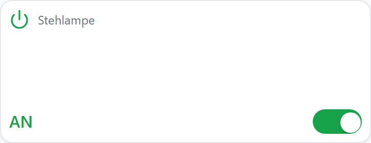
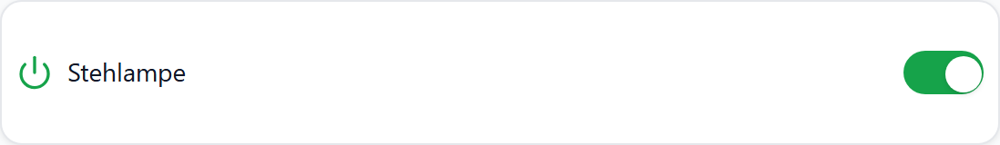
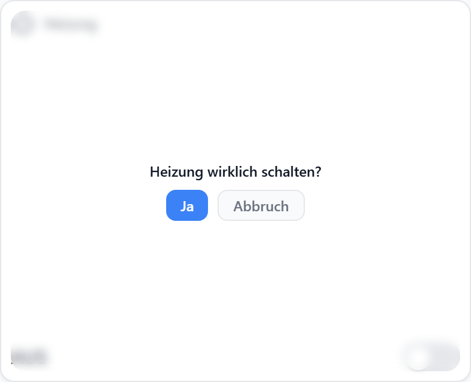

# Schalter

Der Schalter steuert einen **booleschen Datenpunkt** (z. B. eine Steckdose, ein Relais, einen Skript-Trigger). Er kann als klassischer Schiebeschalter oder als Icon-Taster dargestellt werden und unterstützt Layouts vom kompakten Listeneintrag bis zur großen Karte.



## Wann verwenden

- Du willst einen `boolean`-Datenpunkt **ein/aus** schalten.
- Du brauchst einen **Taster** (kurzer Impuls statt umschalten).
- Du willst eine **Sicherheitsabfrage** vor dem Schalten zeigen.

Für dimmbare/farbige Lichter ist das [Lampen-Widget](./) besser geeignet.

## Datenpunkt

| Feld | Pflicht | Typ | Beschreibung |
| --- | --- | --- | --- |
| `datapoint` | ja | `boolean` | Wird beim Klick getoggelt bzw. auf `true` gepulst (Taster-Modus). |

## Layouts

Der Schalter unterstützt vier Layouts. Du wählst sie im Konfigurations-Panel oben.

### Default

Titel + Status-Text + Schiebeschalter in einer Spalte. Geeignet für mittlere Zellen.


### Card

Vollflächige farbige Karte, die im AN-Zustand grün leuchtet. Für prominente Schalter auf dem Dashboard.


### Compact

Eine Zeile: Icon + Titel + Schalter. Ideal für Listen mit vielen Schaltern.



### Custom

Custom-Grid: Du platzierst Icon, Titel, Status und Schalter frei in einer Zellenmatrix. Siehe [Custom-Grid](./).


## Einstellungen

### Anzeige

| Option | Standard | Beschreibung |
| --- | --- | --- |
| **Titel anzeigen** (`showTitle`) | `true` | Blendet den Titel oberhalb des Schalters aus/ein. |
| **Status-Text anzeigen** (`showLabel`) | `true` | Zeigt `AN`/`AUS` neben dem Schalter. |
| **Icon anzeigen** (`showIcon`) | `true` | Blendet das Widget-Icon aus/ein. |
| **Icon** (`icon`) | `Power` | Lucide-Icon-Name. Mehr Icons: [lucide.dev](https://lucide.dev). |
| **Icon-Größe** (`iconSize`) | `20` | Größe in Pixeln. |
| **Titel-Ausrichtung** (`titleAlign`) | `left` | `left`, `center`, `right`. |
| **Titel-Position** (`titlePosition`) | — | Position des Titels im Container. |
| **Inhalt-Position** (`contentPosition`) | — | Vertikale Ausrichtung des Schalter-Blocks. |

### Steuerelement

| Option | Standard | Beschreibung |
| --- | --- | --- |
| **Steuer-Modus** (`controlMode`) | `toggle` | `toggle` = Schiebeschalter, `icon` = Icon-Taster. |
| **AN-Icon** (`onIcon`) | Widget-Icon | Lucide-Icon, das im AN-Zustand gezeigt wird (nur Icon-Modus). |
| **AUS-Icon** (`offIcon`) | Widget-Icon | Lucide-Icon, das im AUS-Zustand gezeigt wird (nur Icon-Modus). |
| **AN-Farbe** (`onColor`) | `--accent-green` | CSS-Farbe oder CSS-Variable. |
| **AUS-Farbe** (`offColor`) | `--text-secondary` | CSS-Farbe oder CSS-Variable. |
| **Icon-Größe (Steuerelement)** (`controlIconSize`) | `28` | Größe des AN/AUS-Icons in Pixeln. |


### Taster-Modus

Statt zu toggeln, schreibt der Schalter kurz `true` und nach der angegebenen Verzögerung wieder `false`. Praktisch für Skript-Trigger.

| Option | Standard | Beschreibung |
| --- | --- | --- |
| **Taster-Modus** (`momentary`) | `false` | Aktiviert den Impuls-Modus. |
| **Taster-Verzögerung in ms** (`momentaryDelay`) | `500` | Wartezeit vor dem Reset auf `false`. |

### Sicherheitsabfrage

Zeigt vor dem eigentlichen Schalten ein kleines Bestätigungs-Popup direkt am Schalter (Anchor-positioniert, ohne Backdrop).

| Option | Standard | Beschreibung |
| --- | --- | --- |
| **Bestätigung anfordern** (`confirmAction`) | `false` | Aktiviert die Sicherheitsabfrage. |
| **Bestätigungstext** (`confirmText`) | _leer_ | Anzeigetext im Popup, z. B. „Wirklich Garage öffnen?". |



### Status-Badges

Optional kann der Schalter Batterie- und Reichweiten-Status der Quelle als kleine Badges anzeigen. Konfiguration siehe [Status-Badges](./).

## Beispiele

### Wandsteckdose ein/aus

```yaml
title: Stehlampe
icon: Lamp
datapoint: hue.0.lights.standlight.state
layout: default
options:
  controlMode: toggle
  showLabel: true
```

### Garagentor (Taster mit Sicherheitsabfrage)

```yaml
title: Garage
icon: Garage
datapoint: shelly.0.SHSW-1#aabbcc#1.Relay0.Switch
layout: card
options:
  momentary: true
  momentaryDelay: 800
  confirmAction: true
  confirmText: Garage wirklich öffnen?
```

### Skript-Trigger (Icon-Taster)

```yaml
title: Gute Nacht
datapoint: javascript.0.scenes.goodNight
layout: compact
options:
  controlMode: icon
  onIcon: Moon
  offIcon: Moon
  onColor: var(--accent)
  momentary: true
```

## Verwandt

- [Lampen-Widget](./) — wenn der Datenpunkt dimmbar oder farbig ist
- [Universal-Widget](./) — für komplexere Zellen mit mehreren Datenpunkten
