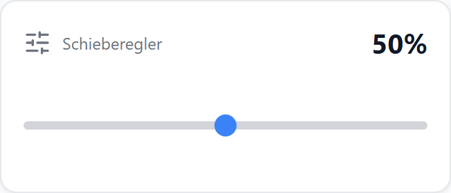
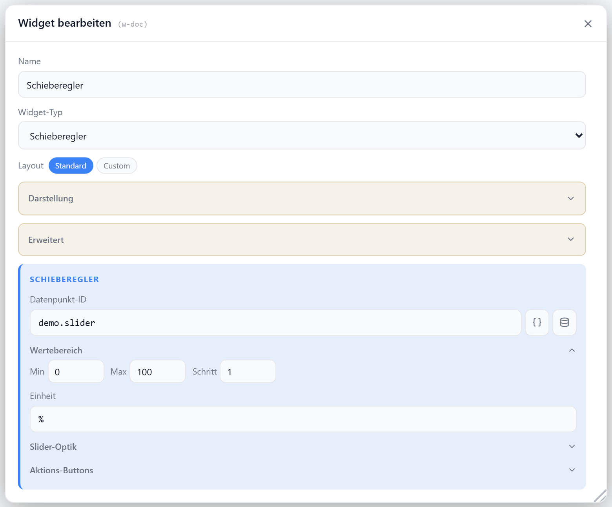

# Schieberegler

Stellt einen beliebigen Zahlenwert per Schieberegler ein. Frei wählbarer Wertebereich, Schrittweite und Einheit, wahlweise horizontal oder vertikal, als nativer Regler oder gefüllter Balken. Optionale Aktions-Tasten schreiben feste Werte.

## Datenpunkt

| Feld | Pflicht | Typ | |
| --- | --- | --- | --- |
| `datapoint` | ja | `number` | eingestellter Wert; nicht-numerische Werte fallen auf `min` zurück |
| `actions[].dp` | nein | — | DP einer Aktions-Taste; schreibt `value` (Standard `true`) |

## Layouts

### Horizontal (Default)
Titel/Icon und Wert oben, Schieberegler darunter (optional mit Min/Max-Beschriftung), Aktions-Tasten unten — für mittlere Zellen.

### Vertikal
Wert oben, hochkant stehender Regler, Aktions-Tasten unten — bei `orientation: vertical`.

### Custom
Wert, Regler und Aktions-Tasten frei in einer Zellenmatrix platzieren — siehe [Custom-Layout](./custom-layout).

## Einstellungen

Alle Optionen werden im Editor unter **Widget bearbeiten** gesetzt.

### Anzeige

| Option | Standard | |
| --- | --- | --- |
| `showTitle` | `true` | Titel anzeigen |
| `showIcon` | `true` | Icon anzeigen |
| `showValue` | `true` | Wert anzeigen |
| `showUnit` | `true` | Einheit am Wert anzeigen |
| `showMinMax` | `false` | Min/Max neben dem Regler anzeigen |
| `showScale` | `false` | Skala mit den Schrittwerten unter dem Regler; ersetzt `showMinMax` |
| `scaleLabelEvery` | — | nur jeden n-ten Schritt beschriften; leer = so viele, wie die Breite hergibt |
| `scaleTicks` | `true` | Skalenstriche zeichnen |
| `icon` | `SlidersHorizontal` | [Lucide-Icon](https://lucide.dev) |
| `iconSize` | `20` | px |
| `titleAlign` | `left` | `left` · `center` · `right` |
| `unit` | — | Einheit hinter dem Wert |

### Wertebereich

| Option | Standard | |
| --- | --- | --- |
| `min` | `0` | unterer Wert |
| `max` | `100` | oberer Wert |
| `step` | `1` | Schrittweite |

### Umrechnung

Rechnet zwischen der Einheit des Datenpunkts und der Einheit um, in der bedient wird — in **beide** Richtungen: gelesen wird `Wert × Faktor + Offset`, geschrieben `(Eingabe − Offset) ÷ Faktor`. `min`, `max`, `step`, `unit` und die Skala gelten dann in der umgerechneten Einheit, der Datenpunkt behält seine eigene.

| Option | Standard | |
| --- | --- | --- |
| `valueFactor` | `1` | Multiplikator |
| `valueOffset` | `0` | Summand |

Vorlagen im Dialog über den Knopf **ƒ** neben dem Datenpunkt: Sekunden → Minuten/Stunden, Millisekunden → Sekunden, Wh → kWh, W → kW, Bytes → KB/MB/GB, 0..1 → Prozent, °C → °F — oder *Eigene…* für Faktor und Offset von Hand.

### Steuerelement

| Option | Standard | |
| --- | --- | --- |
| `orientation` | `horizontal` | `horizontal` · `vertical` |
| `barStyle` | `false` | gefüllter Balken statt nativem Regler |
| `barSize` | `100` | Höhe/Breite des Balkens in % (nur bei `barStyle`) |
| `sliderThickness` | `6` | Dicke der Reglerspur in px (nur ohne `barStyle`) |
| `color` | `--accent` | CSS-Farbe oder Variable für Füllung/Thumb |
| `commitOnRelease` | `false` | Wert erst beim Loslassen schreiben (sonst live) |
| `readOnly` | `false` | nur anzeigen, nicht bedienbar |

### Aktions-Tasten

| Option | Standard | |
| --- | --- | --- |
| `actions` | — | Liste von Tasten mit `icon`, `label`, `dp` und optionalem `value` |

### Status-Datenpunkte

Optionale Batterie- und Erreichbarkeits-DPs werden als kleine Badges eingeblendet (Abschnitt **Status-Datenpunkte** im Dialog).
