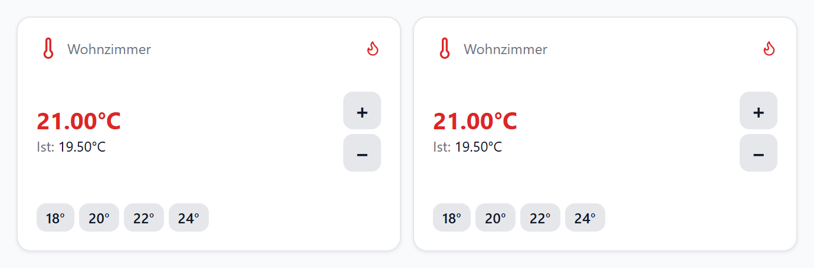
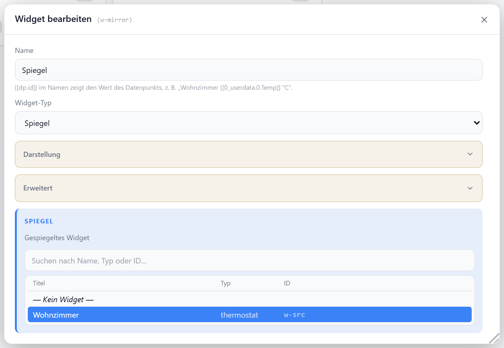

# Spiegel

Zeigt ein vorhandenes Widget live an einer zweiten Stelle an — kein Duplikat: Änderungen an der Quelle wirken sofort mit.

Links das Quell-Widget, rechts der Spiegel.

## Datenpunkt

Keiner. Der Spiegel speichert nur die ID des Quell-Widgets (`targetWidgetId`) und löst sie bei jedem Rendern neu auf.

## Quelle wählen

Im Editor unter **Widget bearbeiten → Spiegel**. Die Liste enthält jedes Widget des ganzen Dashboards — auch aus anderen Layouts, Bereichen und Tabs — und ist nach Name, Typ und ID durchsuchbar.

| Option | Standard | |
| --- | --- | --- |
| `targetWidgetId` | — | ID des Quell-Widgets; `— Kein Widget —` hebt die Zuordnung auf |

Beim Auswählen übernimmt der Spiegel einmalig Breite, Höhe und die Rahmen-Optionen `transparent`, `transparency` und `styleOverride` der Quelle, damit er von Anfang an gleich aussieht. Danach sind beide unabhängig.

## Quelle vs. Spiegel

| | kommt von |
| --- | --- |
| Inhalt, Titel, Icon, Werte, Layout | Quelle |
| Position im Raster | Spiegel |
| Größe (`w` × `h`) | Spiegel — beim Auswählen von der Quelle übernommen |
| Transparenz und Stil-Overrides des Rahmens | Spiegel |
| „Letzte Änderung"-Overlay | Quelle |
| Widget-neu-laden per Bedingung | Quelle **und** eigener Rahmen |

Der Spiegel ist bedienbar wie die Quelle — Schalter schalten, Regler regeln, alles auf demselben Datenpunkt. Option-Änderungen, die ein Widget selbst speichert, landen auf der **Quelle**; die Position des Spiegels bleibt davon unberührt.

Auf schmalen Bildschirmen richtet sich die automatische Höhe nach dem Typ der Quelle — ein Spiegel einer Gruppe wächst also mit ihrem Inhalt.

## Grenzen

| Fall | Anzeige |
| --- | --- |
| Alle Widget-Typen außer `mirror` | spiegelbar |
| Spiegel eines Spiegels | „Ein Spiegel kann keinen Spiegel spiegeln" — Spiegel stehen nicht in der Auswahlliste |
| Spiegel auf sich selbst | „Spiegel kann sich nicht selbst spiegeln" |
| Quelle gelöscht | „Quell-Widget existiert nicht mehr" mit der gesuchten ID |
| Keine Quelle gewählt | im Editor Hinweis, im Frontend leer |
