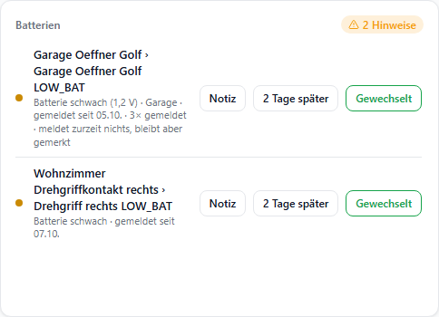
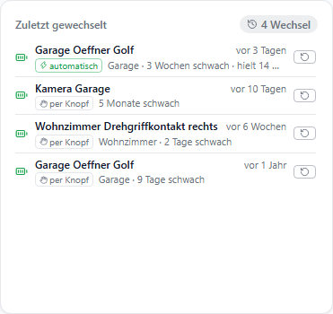

# Statusübersicht

Zeigt von selbst, was Aufmerksamkeit braucht: offene Fenster und Türen, schwache Batterien, nicht erreichbare Geräte, Rauch-/Wasseralarme, eingeschaltete Lichter. Die Geräte werden über Rollen und Gewerke gefunden, eine Liste muss niemand pflegen.

## Layouts

| Layout | |
| --- | --- |
| `default` | nach Kategorie gruppiert |
| `compact` | eine Liste, sortiert |
| `twoline` | Zweizeilig: Punkt in der Farbe der Schwere, Name fett, darunter Messwert und Hinweise, große Knöpfe rechts; Überschrift nur bei mehreren Kategorien |
| `card` | Kacheln |
| `minimal` | Pillen |
| `count` | nur der Zähler |
| `history` | Zuletzt gewechselt – geschlossene Hinweise aus dem Adapter-Verlauf, siehe unten |

Knöpfe (Zeilen-Aktionen, „Gewechselt“, „Später“) gibt es in `default`, `compact` und `twoline`.



## Merkliste

Batteriegeräte (vor allem HomeMatic) setzen LOWBAT bei Kälte oder Last kurz auf `true` und danach wieder auf `false`. Mit der **Merkliste** (eigener Abschnitt unter den Kategorien) bleibt ein solcher Hinweis stehen, bis er geschlossen wird – für Batterien, nicht erreichbare Geräte und ausgelöste Rauch-/Wassermelder.

| Option | Vorgabe | |
| --- | --- | --- |
| `latchBattery` | aus | schwache Batterien merken |
| `latchUnreach` | aus | Ausfälle merken |
| `latchAlarm` | aus | ausgelöste Rauch-/Wassermelder merken |
| `latchSnoozeDays` | 2 | „Später“ stellt um so viele Tage zurück |
| `latchRecheckDays` | 7 | Nachkontrolle nach dem Schließen |
| `latchAutoClose` | aus | Batterie: schließt bei deutlichem Spannungs-/Prozentsprung |
| `latchConfirm` | an | „Gewechselt“/„Quittieren“ erst nach zweitem Tippen |

| Anzeige in der Zeile | Bedeutung |
| --- | --- |
| seit 05.10. | erste Meldung |
| 3× gemeldet | so oft von „ok“ auf „Problem“ gewechselt |
| meldet zurzeit nichts, bleibt gemerkt | Datenpunkt ist wieder ok – Zeile gedämpft |
| zurückgestellt bis 07.10. | „Später“ getippt – gedämpft, zählt nicht im Zähler |
| trotz Wechsel am 01.10. | in der Nachkontrolle erneut gemeldet |

| Regel | |
| --- | --- |
| Nachkontrolle | Nur eine Meldung mindestens 10 min nach dem Schließen öffnet wieder – ein alter, stehengebliebener Wert nicht. |
| Automatisch schließen (Spannung) | `OPERATING_VOLTAGE` mindestens 0,3 V **und** 25 % über dem tiefsten Wert des Eintrags |
| Automatisch schließen (Prozent) | mindestens 40 % **und** 30 Punkte über dem tiefsten Wert |

Die Liste führt der Adapter: alle Browser sehen dieselbe, „Gewechselt“ schließt überall gleichzeitig, und gemerkt wird auch ohne offenen Browser.

### Adapter-States

| State | Richtung | Inhalt |
| --- | --- | --- |
| `aura.0.status.<cat>.list` | Adapter → alle | JSON-Liste der Einträge |
| `aura.0.status.<cat>.cmd` | Widget / Skript → Adapter | Befehle, siehe unten |
| `aura.0.status.<cat>.event` | Adapter → Skript | `new` · `reopened` · `closed` (JSON) |
| `aura.0.status.<cat>.history` | Adapter → alle | geschlossene Einträge, neueste zuerst (JSON) |
| `aura.0.status.<cat>.sources` | Adapter | welche Widgets was beobachten |
| `aura.0.status.register` | Widget → Adapter | Anmeldung der Widgets |

`<cat>` = `battery`, `unreach` oder `alarm`.

| Feld eines Eintrags | |
| --- | --- |
| `id`, `name`, `room` | Datenpunkt, Gerätename, Raum |
| `since`, `last` | erste / letzte Meldung (ms) |
| `count` | wie oft gemeldet |
| `active` | meldet gerade |
| `snoozedUntil` | zurückgestellt bis (ms) |
| `ackedAt`, `closedBy` | geschlossen am, durch `ack` / `auto` |
| `reopenedAfter` | wieder geöffnet nach Schließen am (ms) |

| Befehl | |
| --- | --- |
| `ack:<id>` | schließen („Gewechselt“) |
| `snooze:<id>` / `snooze:<id>@3` | zurückstellen (Vorgabe 2 Tage) |
| `unsnooze:<id>` | Zurückstellen aufheben |
| `add:<id>` / `add:<id>@2026-09-20` | Eintrag anlegen, optional mit „seit“ |
| `remove:<id>` | Eintrag löschen, ohne Nachkontrolle |
| `reopen:<id>@<closedAt>` | Wechsel zurücknehmen: Verlaufseintrag weg, Eintrag wieder offen, Event `reopened` mit `reason: "manual"` |
| `import:<JSON-Array>` | alten Verlauf übernehmen: `{datenpunkt, ts, seit, name, art}` oder das eigene Format; Doppelte werden übersprungen |
| `{"cmd":"add","id":"…","since":…,"count":3}` | JSON, auch als Array |

`<id>` ist der Datenpunkt, die Geräte-Id oder nur die Seriennummer (`ack:0020da499b8f41`).

```js
// Benachrichtigung bei neuem oder wieder geöffnetem Eintrag
on({ id: 'aura.0.status.battery.event', change: 'any' }, (obj) => {
    const e = JSON.parse(obj.state.val);
    if (e.type === 'new') sendTo('telegram.0', `Batterie schwach: ${e.name}`);
    if (e.type === 'reopened') sendTo('telegram.0', `Batterie wieder schwach: ${e.name}`);
});

// Bestehenden Verlauf übernehmen (0_userdata.0.Batterien.Verlauf holt der Adapter
// beim Start selbst, solange sein eigener Verlauf leer ist)
setState('aura.0.status.battery.cmd', `import:${getState('0_userdata.0.Batterien.Verlauf').val}`);

// Bestehende Merkliste übernehmen (Schlüssel = Seriennummer)
const alt = JSON.parse(getState('0_userdata.0.Batterien.Merkliste').val || '{}');
setState('aura.0.status.battery.cmd', JSON.stringify(
    Object.entries(alt).map(([serial, v]) => ({ cmd: 'add', id: serial, since: v.since })),
));
```

## Zuletzt gewechselt

Layout `history`: eine zweite Statusübersicht neben der Merkliste, die zeigt, was geschlossen wurde. Die Daten führt der Adapter (`aura.0.status.<cat>.history`), sie überstehen einen Neustart und sind auf allen Geräten gleich.



| Zeile | |
| --- | --- |
| Name | wie in den anderen Layouts (`namePattern`, `nameFilters`) |
| vor 3 Tagen | Zeitpunkt des Wechsels – genau im Tooltip |
| per Knopf / automatisch | „Gewechselt“ getippt bzw. Spannungs-/Prozentsprung erkannt |
| 3 Wochen schwach | Zeit von der ersten Meldung bis zum Wechsel |
| hielt 14 Monate | Zeit seit dem vorigen Wechsel desselben Geräts – nur ab dem zweiten |
| 1,1 V → 1,5 V | Spannung/Prozent vor und nach dem Wechsel, wenn bekannt |
| ↺ | „Wieder öffnen“ – nach zweitem Tippen zurück in die Merkliste |

| Option | Vorgabe | |
| --- | --- | --- |
| `maxRows` | – | höchstens so viele Zeilen, Rest als „+N weitere“; macht die Höhe planbar |
| `maxAgeDays` | – | nur Wechsel der letzten N Tage |
| `showReason` | an | per Knopf / automatisch |
| `showDuration` | an | wie lange schwach |
| `showLifetime` | an | wie lange die Batterie davor hielt |
| `showRoom` | an | Raum |
| `catBattery`, `catUnreach`, `catAlarm` | an | welche Verläufe |
| `excludeIds`, `excludeIdPatterns`, `filterRooms`, `filterFuncs`, `filterAdapters` | – | wie in den anderen Layouts |

Die Merkliste-Optionen (`latch…`), Zeilen-Aktionen und die Bewertung der Live-Werte wirken in diesem Layout nicht. Die Verlaufs-Instanz meldet nichts beim Adapter an – das tut die Live-Instanz.

| Adapter-Einstellung (Instanz) | Vorgabe | |
| --- | --- | --- |
| Gespeicherte Wechsel | 50 | je Kategorie |
| Wechsel aufbewahren (Tage) | 730 | 0 = unbegrenzt |

Der jeweils letzte Wechsel eines Geräts bleibt immer erhalten, damit der nächste „hielt …“ zeigen kann.

| Feld eines Verlaufseintrags | |
| --- | --- |
| `id`, `name`, `room` | Datenpunkt, Gerätename, Raum |
| `since` | schwach seit (ms) |
| `closedAt` | gewechselt am (ms) |
| `reason` | `ack` (Knopf) · `auto` (Sprung erkannt) |
| `levelBefore`, `levelAfter`, `unit` | Spannung/Prozent vor und nach |
| `count` | wie oft gemeldet |
| `prevClosedAt` | voriger Wechsel desselben Geräts (ms) |
| `imported` | aus einem alten Verlauf übernommen |

**Liste und Verlauf:** Ein geschlossener Eintrag bleibt für die Nachkontrolle (`latchRecheckDays`) mit `ackedAt`/`closedBy` in `list` – nur dort kann eine neue Meldung ihn wieder öffnen („trotz Wechsel am …“). Der Wechsel selbst steht ab dem Schließen in `history` und bleibt dort, wenn der Listeneintrag nach der Nachkontrolle verschwindet.

## Zeilen-Aktionen

Eigene Knöpfe am Zeilenende, die einen Wert in einen Datenpunkt schreiben (`rowActions`).

| Feld | |
| --- | --- |
| `label` | Beschriftung |
| `targetDp` | Ziel-Datenpunkt |
| `value` | Wert; `true`/`false`/Zahlen werden typgerecht geschrieben |
| `categories` | nur bei diesen Kategorien (leer = alle) |
| `confirm`, `confirmLabel` | erst nach zweitem Tippen (Text des scharfen Knopfs, Vorgabe „Wirklich?“) |

Ein Knopf erscheint, wenn alles drei zutrifft:

| Bedingung | |
| --- | --- |
| Zeile wird gezeigt | Standard: nur Auffälliges (Licht an, Fenster offen …); mit „Alle gefundenen Geräte“ an jeder Zeile |
| Kategorie passt | `categories` leer = jede Zeile |
| Layout | `default` oder `compact` |

| Vorlage | Knopf | Ziel / Wert | Kategorie |
| --- | --- | --- | --- |
| Licht aus | Aus | `{id}` / `false` – der Datenpunkt der Zeile selbst | Lichter |
| Fenster: Erinnern | Erinnern | eigener Datenpunkt / `{name} ({room}) ist offen` | Fenster & Türen |
| Batterie: an Skript melden | Gewechselt | eigener Datenpunkt / `gewechselt:{serial}`, mit Rückfrage | Batterien |

| Platzhalter | Beispiel |
| --- | --- |
| `{id}` | `hm-rpc.1.0020DA499B8F41.0.LOW_BAT` |
| `{device}` | `hm-rpc.1.0020DA499B8F41` |
| `{serial}` | `0020DA499B8F41` |
| `{name}` | angezeigter Name |
| `{room}` | Raum |

## „seit …“

`sinceCategories` (Vorgabe `["window"]`) schaltet die Dauer auch für `battery` und `unreach` ein.
