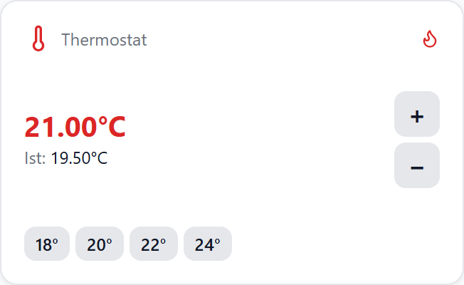
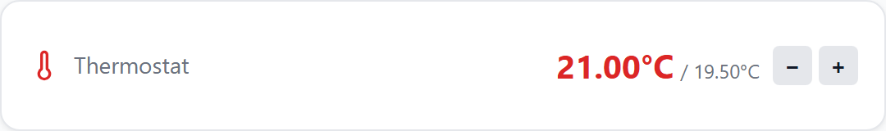
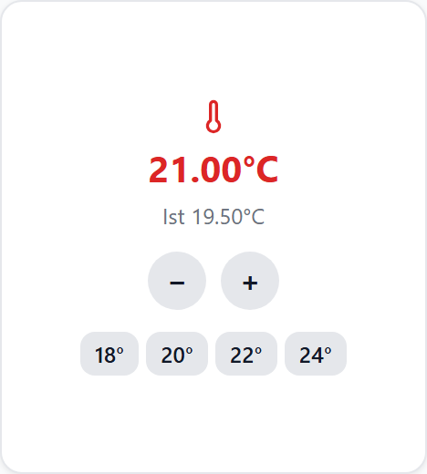
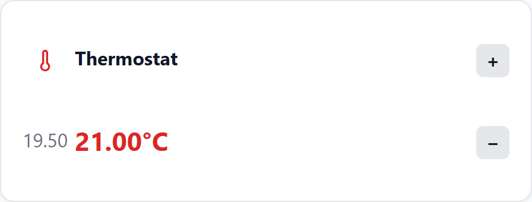

# Thermostat

Stellt die Soll-Temperatur per Plus/Minus-Tasten ein und zeigt optional die Ist-Temperatur an. Heiz-/Kühl-Status wird per Icon und Akzentfarbe dargestellt, im Default-Layout ergänzt durch einen Fortschrittsbalken.

## Datenpunkt

| Feld | Pflicht | Typ | |
| --- | --- | --- | --- |
| `datapoint` | ja | `number` | Soll-Temperatur |
| `actualDatapoint` | nein | `number` | Ist-Temperatur |

## Layouts

### Default
Anatomie: Titelzeile (Icon + Titel links, Heiz-/Kühl-Symbol rechts) · große Soll-Temperatur mit Ist-Wert darunter · Plus/Minus-Tasten rechts · Preset-Buttons unten. Für mittlere Zellen.

### Compact
Anatomie: eine Zeile — Icon · Titel · `Soll°C / Ist°C` · Minus/Plus. Für Listen mit vielen Thermostaten.

### Minimal
Anatomie: zentriert gestapelt — Icon · Soll-Temperatur · Ist-Temperatur · Minus/Plus · Preset-Buttons. Für sehr kleine Zellen.

### Custom
Icon, Soll-Wert (`value`), Ist-Wert (`actual`), Status (`status`) und Tasten (`btn-plus`/`btn-minus`) frei in einer Zellenmatrix platzieren — siehe [Custom-Layout](./custom-layout).

## Einstellungen

Alle Optionen werden im Editor unter **Widget bearbeiten** gesetzt.

### Anzeige

| Option | Standard | |
| --- | --- | --- |
| `showTitle` | `true` | Titel anzeigen |
| `showIcon` | `true` | Icon anzeigen |
| `showSetpoint` | `true` | Soll-Temperatur anzeigen |
| `showActualTemp` | `true` | Ist-Temperatur anzeigen |
| `showControls` | `true` | Plus/Minus-Tasten anzeigen |
| `icon` | `Thermometer` | [Lucide-Icon](https://lucide.dev) |
| `iconSize` | `20` | px |
| `titleAlign` | `left` | `left` · `center` · `right` |
| `decimals` | globale Vorgabe | Nachkommastellen |

### Steuerung

| Option | Standard | |
| --- | --- | --- |
| `minTemp` | `10` | untere Grenze der Soll-Temperatur |
| `maxTemp` | `30` | obere Grenze der Soll-Temperatur |
| `step` | `0.5` | Schrittweite je Tastendruck |
| `showPresets` | `true` | Preset-Buttons anzeigen |
| `presets` | `[18,20,22,24]` | Soll-Temperatur-Presets (°C) |

### Schwellwerte

Färbt die angezeigte Temperatur abhängig vom Ist- (bzw. Soll-)Wert.

| Option | Standard | |
| --- | --- | --- |
| `colorThresholds` | — | Liste aus `[Schwelle, Farbe]`, z. B. `[[18,"#00f"],[30,"#f00"]]` |

### Status-Datenpunkte

Optionale Batterie- und Erreichbarkeits-DPs werden als kleine Badges eingeblendet (Abschnitt **Status-Datenpunkte** im Dialog).
