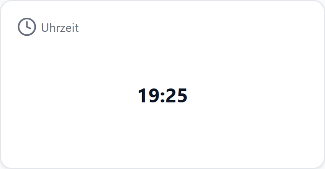
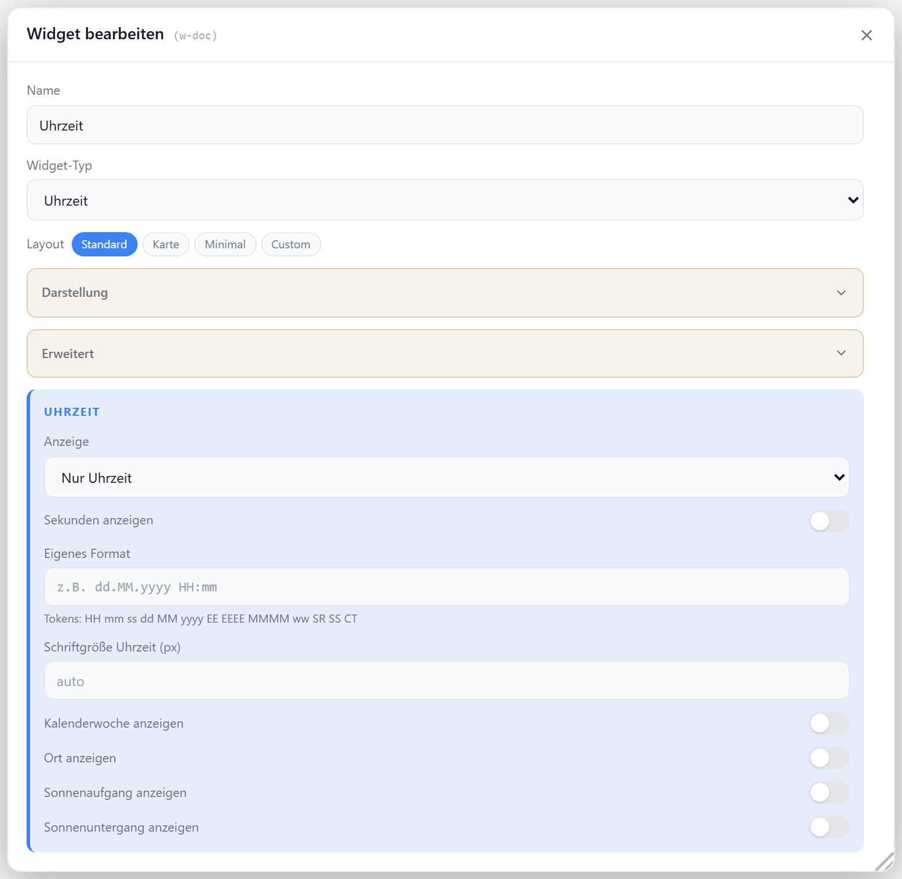

# Uhrzeit

Zeigt die aktuelle Uhrzeit und/oder das Datum an — ohne Datenpunkt. Optional mit Wochentag, Monatsname, freiem Format-String sowie Zusatz-Chips für Kalenderwoche, Ort, Sonnenauf- und -untergang.

Mit einem **Quell-Datenpunkt** wird stattdessen ein fremder Zeitwert formatiert (z. B. `evcc.0.…full` mit `2026-07-31T20:15:30+02:00` → `31.07.2026 20:15`).

## Layouts

### Default
Titel/Icon oben, Uhrzeit und Datum zentriert darunter — für mittlere Zellen.

### Card
Große zentrierte Uhrzeit/Datum, Titelzeile darunter — für prominente Anzeige.

### Minimal
Nur Uhrzeit (bzw. Datum/Format) zentriert — für sehr kleine Zellen.

### Custom
Uhrzeit, Datum, Format und Extra-Felder frei in einer Zellenmatrix platzieren — siehe [Custom-Layout](./custom-layout).

## Einstellungen

Alle Optionen werden im Editor unter **Widget bearbeiten** gesetzt.

### Quell-Datenpunkt

Leer = aktuelle Uhrzeit. Sonst wird der Wert des Datenpunkts als Zeit gelesen und mit denselben Optionen formatiert. JSON-Pfad (`…#pfad`) wird unterstützt.

| Wert im Datenpunkt | Beispiel |
| --- | --- |
| ISO-Zeitstempel | `2026-07-31T20:15:30+02:00` · `2026-07-31 20:15:30` · `2026-07-31` |
| Uhrzeit (heutiges Datum) | `20:15` · `20:15:30` |
| Unix-Zeit (s oder ms) | `1785528196` · `1785528196311` |

Nicht lesbare oder leere Werte zeigen `–`.

### Anzeige

| Option | Standard | |
| --- | --- | --- |
| `display` | `time` | `time` · `date` · `datetime` |
| `showSeconds` | `false` | Sekunden in der Uhrzeit |
| `dateLength` | `short` | `short` (TT.MM.JJJJ) · `long` (Wochentag, Tag. Monat JJJJ) |
| `customFormat` | — | freier Format-String, überschreibt `display` |

### Format-Tokens

Tokens für `customFormat` — werden durch die aktuellen Werte ersetzt.

| Token | |
| --- | --- |
| `EEEE` / `EE` | Wochentag lang / kurz |
| `MMMM` | Monatsname |
| `yyyy` / `yy` | Jahr 4- / 2-stellig |
| `MM` / `dd` | Monat / Tag |
| `HH` / `hh` | Stunde 24h / 12h |
| `mm` / `ss` | Minute / Sekunde |
| `ww` | Kalenderwoche (ISO-8601) |
| `SR` / `SS` | Sonnenaufgang / -untergang |
| `CT` | Ort aus der System-Konfiguration |
| `REL` | Abstand zu jetzt (`in 3 h 12 min` / `vor 5 min`) — nur mit Quell-Datenpunkt |

### Titel & Icon

| Option | Standard | |
| --- | --- | --- |
| `showTitle` | `true` | Titel anzeigen |
| `showIcon` | `true` | Icon anzeigen |
| `icon` | `Clock` | [Lucide-Icon](https://lucide.dev) |
| `iconSize` | `20` | px |
| `titleAlign` | `left` | `left` · `center` · `right` |

### Schriftgrößen

`0` bedeutet automatische Größe.

| Option | Standard | |
| --- | --- | --- |
| `timeFontSize` | `0` | px für die Uhrzeit |
| `dateFontSize` | `0` | px für das Datum |
| `customFontSize` | `0` | px für das freie Format |
| `extrasFontSize` | `0` | px für die Zusatz-Chips |

### Zusatz-Chips

Kleine Chips unter der Uhrzeit — nutzen Standort und Ort aus der System-Konfiguration.

| Option | Standard | |
| --- | --- | --- |
| `showWeek` | `false` | Kalenderwoche |
| `showCity` | `false` | Ort |
| `showSunrise` | `false` | Sonnenaufgang |
| `showSunset` | `false` | Sonnenuntergang |
