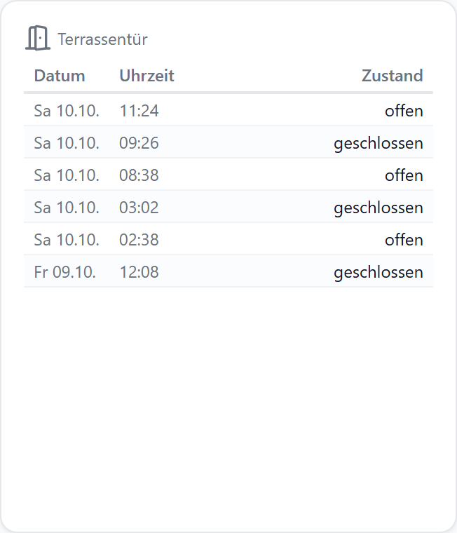
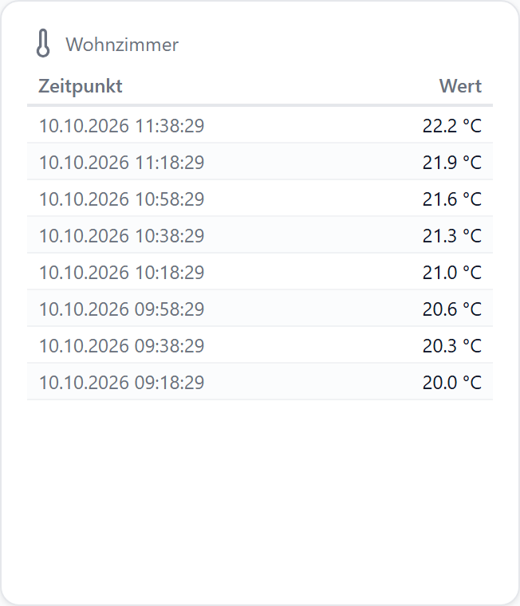
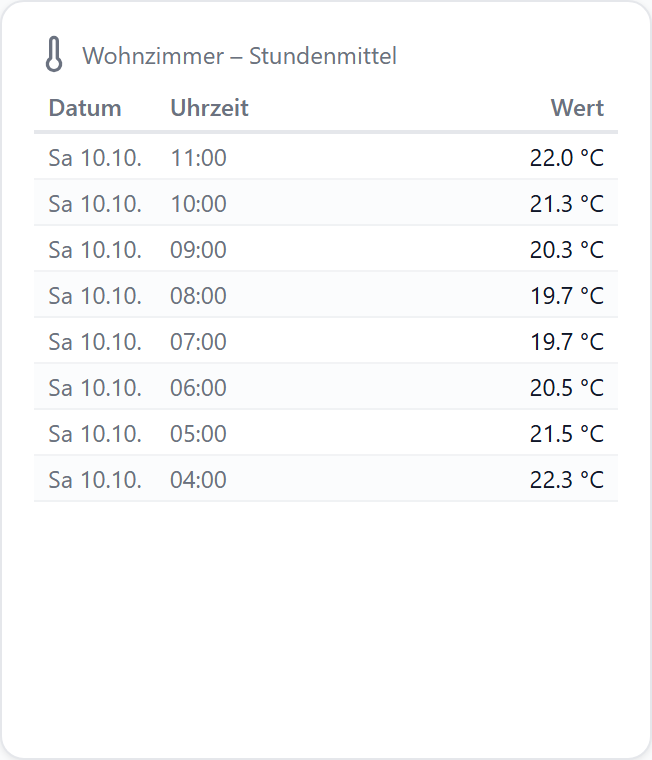
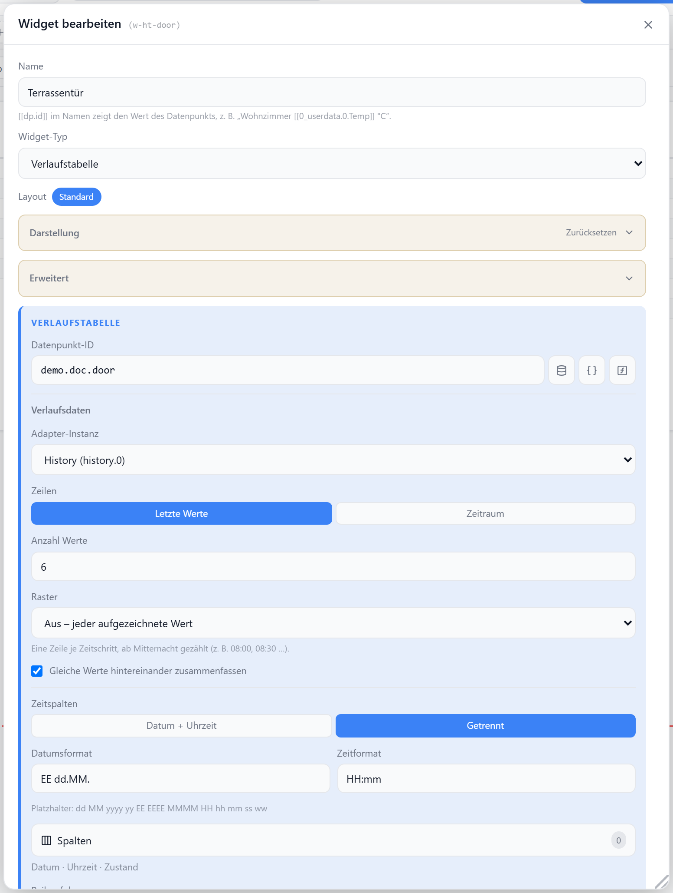

# Verlaufstabelle

Zeigt die aufgezeichneten Werte eines Datenpunkts aus einem History-Adapter (`history`, `sql`, `influxdb`) als Tabelle: die letzten N Werte oder alle Werte eines Zeitraums. Der Datenpunkt muss im Adapter geloggt werden.

| Schaltvorgänge (getrennte Spalten) | Messwerte (Datum + Uhrzeit) | Raster (Stundenmittel) |
| --- | --- | --- |
|  |  |  |

## Datenpunkt

| Feld | Pflicht | Typ | |
| --- | --- | --- | --- |
| `datapoint` | ja | beliebig | Zahlen, true/false und Texte |

## Einstellungen

### Verlaufsdaten

| Option | Standard | |
| --- | --- | --- |
| `historyInstance` | erste aktive | `history.0`, `sql.0`, `influxdb.0` … |
| `historyMode` | `count` | `count` = letzte Werte, `range` = Zeitraum |
| `historyCount` | `20` | Anzahl Zeilen bei `count` (1–500) |
| `historyRange` | `24h` | `1h` `6h` `24h` `7d` `30d` `custom` |
| `historyRangeCustomValue` / `…Unit` | `24` / `h` | eigener Zeitraum, Einheit `h` `d` `w` `M` `y` |
| `hideDuplicates` | `false` | gleiche Werte hintereinander → eine Zeile (Zeitpunkt des Wechsels) |
| `historyInterval` | aus | Raster: eine Zeile je Zeitschritt (1 Min. … 1 Tag), ab Mitternacht gezählt |
| `historyAggregate` | `last` | Wert je Zeitschritt, nur mit Raster |

Zeitraum ohne Raster: Rohwerte, höchstens 2000 Zeilen — bei mehr die neuesten.

#### Raster

| `historyAggregate` | Wert der Zeile | Typen |
| --- | --- | --- |
| `last` (Stand) | der zum Zeitpunkt der Zeile geltende Wert | alle |
| `average` (Mittel) | Mittelwert über den Zeitschritt | Zahlen |
| `min` / `max` | Minimum / Maximum im Zeitschritt | Zahlen |
| `total` (Summe) | Summe im Zeitschritt | Zahlen |

| Zeilen | mit Raster |
| --- | --- |
| `count` | `historyCount` = Anzahl Zeitschritte |
| `range` | alle Zeitschritte des Zeitraums |

Zeitformat-Standard mit Raster: `HH:mm`. Leerer Zeitschritt: `–`.

### Spalten

| Option | Standard | |
| --- | --- | --- |
| `timeColumns` | `combined` | `combined` = Datum + Uhrzeit, `split` = getrennt |
| `dateFormat` | `dd.MM.yyyy` | Platzhalter `dd MM yyyy yy EE EEEE MMMM ww` |
| `timeFormat` | `HH:mm:ss` | Platzhalter `HH hh mm ss` |
| `colDateLabel` / `colTimeLabel` / `colValueLabel` | Datum / Zeitpunkt bzw. Uhrzeit / Wert | Spaltentitel |
| `columns` | – | je Spalte (`date` `time` `value`), Taste **Spalten** |

#### Je Spalte (`columns`)

| Option | |
| --- | --- |
| `hidden` | ausblenden (bleibt sortierbar) |
| `order` | Reihenfolge, Pfeile im Popup |
| `width` | Breite in px |
| `align` | `left` `center` `right` |
| `wrap` | Zeilenumbruch |
| `cellBg` / `cellColor` | Hintergrund- / Textfarbe |
| `prefix` / `suffix` | Text vor / hinter dem Wert |
| `valueTimeFormat` | nur Wert: Zeitstempel als Datum/Uhrzeit |

### Sortierung

| Option | Standard | |
| --- | --- | --- |
| `sortOrder` | `desc` | `desc` = neueste oben, `asc` = älteste oben — entscheidet bei Gleichstand |
| `sortRules` | – | Kriterien wie bei der [JSON-Tabelle](./json-tabelle): Spalte `time` oder `value`, Richtung, Vergleich |
| `sortable` | `false` | Klick auf Spaltentitel sortiert (auf / ab / zurück) |

### Werte

| Option | Standard | |
| --- | --- | --- |
| `unit` | – | Einheit hinter Zahlen |
| `decimals` | ganze Zahlen ohne, sonst global | Nachkommastellen |
| `numberFormat` | global | Tausender-/Dezimaltrennzeichen |
| `valueLabels` | `common.states` | Werttexte, z. B. `0=geschlossen; 1=offen` (true/false = 1/0) |
| `valueFactor` / `valueOffset` | – | Umrechnung (ƒ-Taste am Datenpunkt) |

### Darstellung

| Option | Standard | |
| --- | --- | --- |
| `fontSize` | `12` | Schriftgröße in px |
| `showHeader` | `true` | Spaltentitel |
| `striped` | `true` | Zeilen abwechselnd einfärben |
| `autoHeight` | `false` | Höhe folgt der Zeilenzahl — siehe [Höhe an Inhalt anpassen](../einstellungen/editor#hohe-an-inhalt-anpassen) |

## Aktualisierung

| Ereignis | |
| --- | --- |
| neuer Wert | erscheint sofort oben |
| alle 5 min (Zeitraum ≤ 1 h: 1 min) | Tabelle neu aus dem Adapter |
| Gerät wacht auf | Tabelle neu aus dem Adapter |
