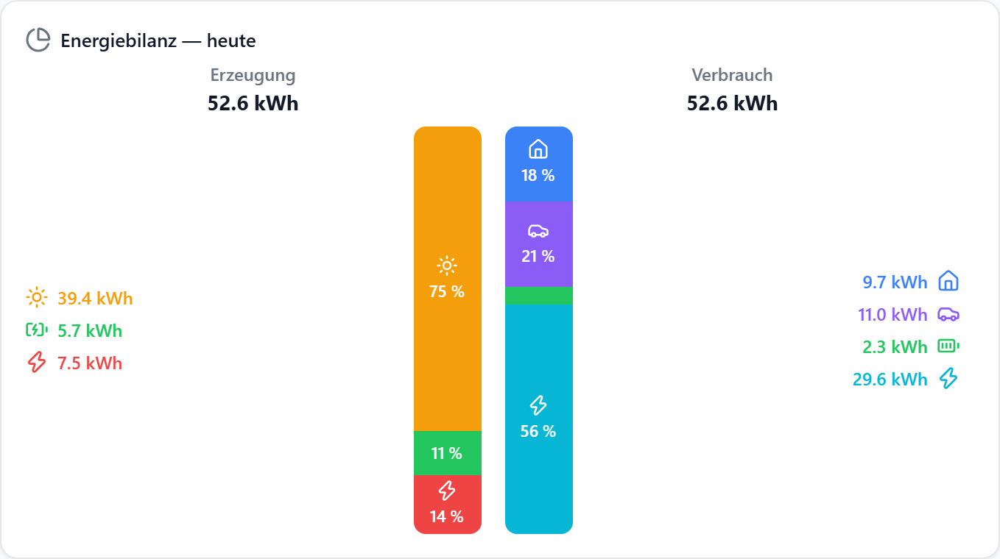
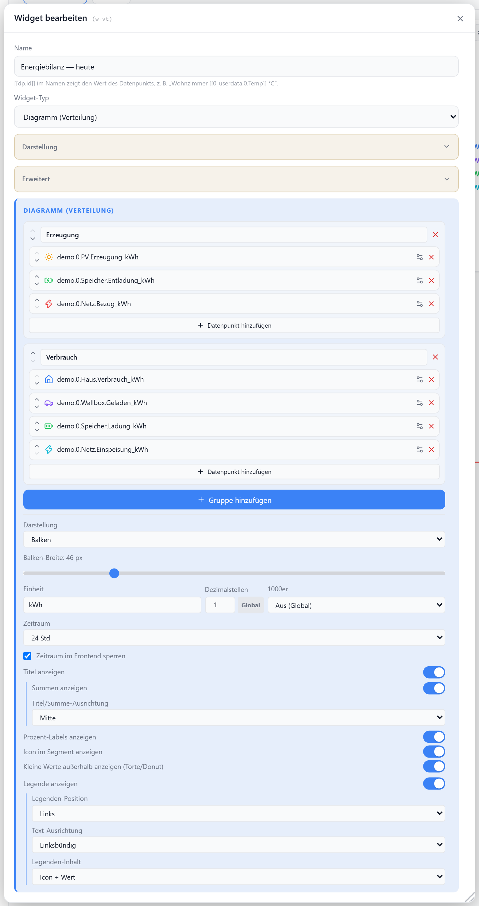
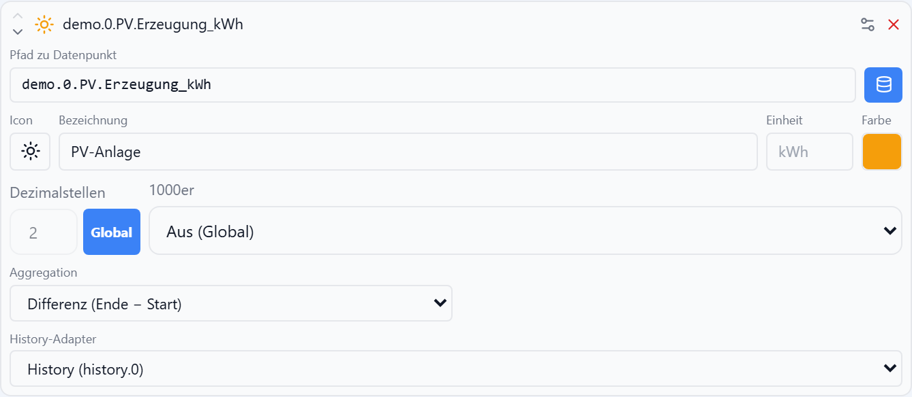
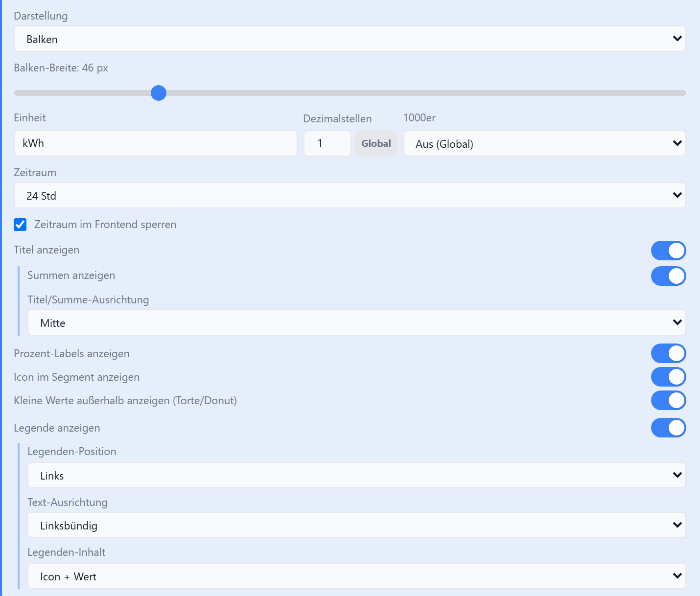
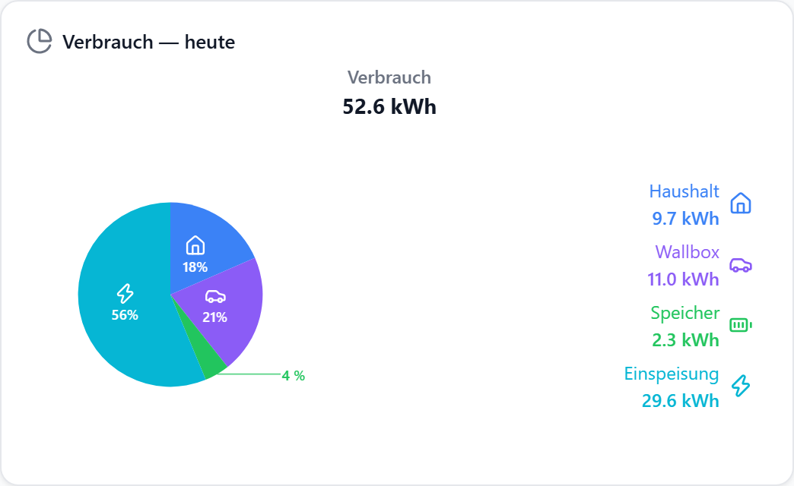
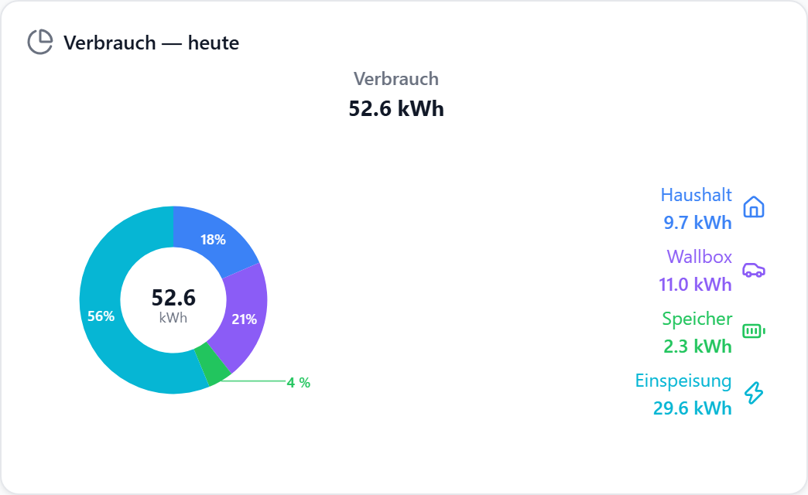
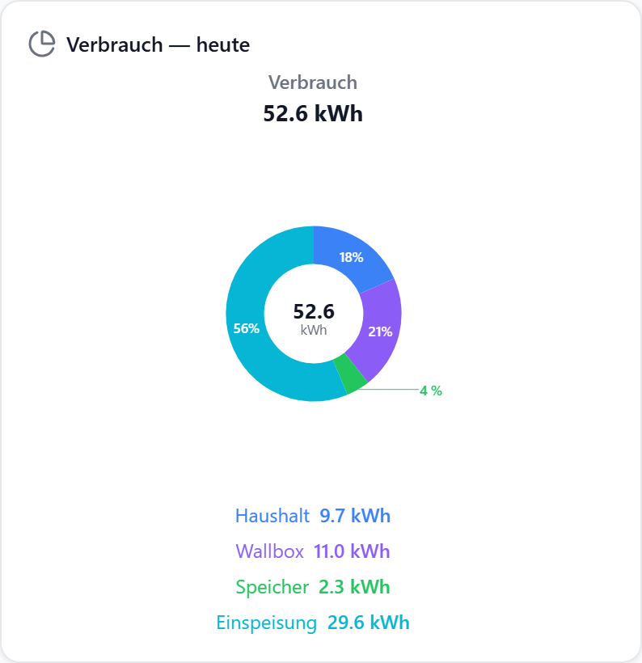
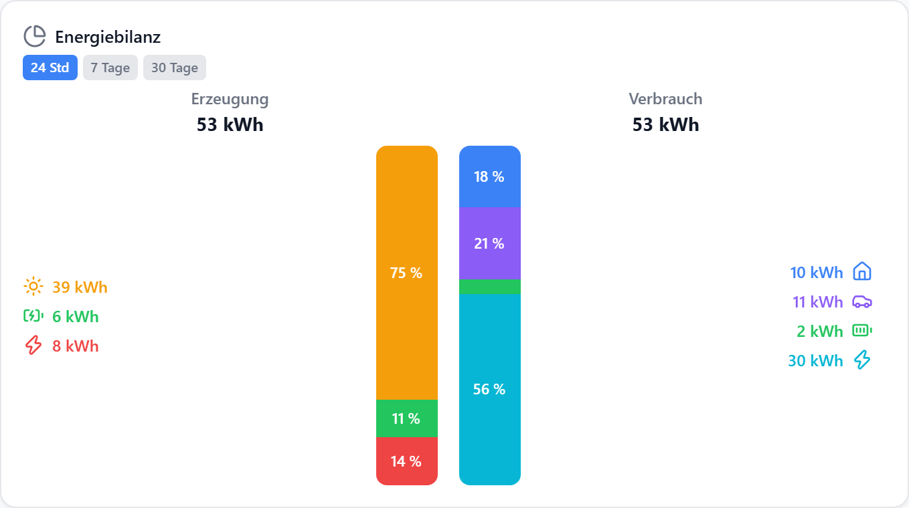
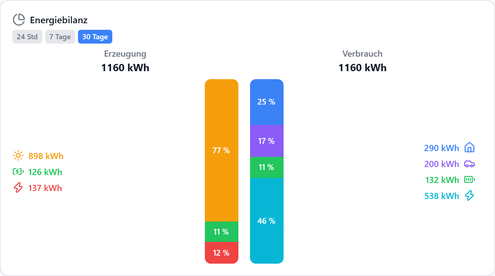
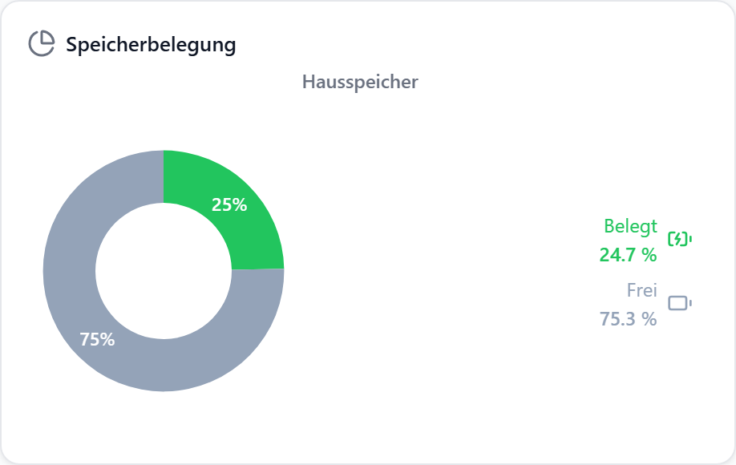

# Diagramm (Verteilung)

Anteilige Darstellung beliebig vieler Gruppen aus mehreren Datenpunkten — als 100-%-Balken, Torte oder Donut. Jeder Eintrag wird über einen Verlaufs-Adapter auf **eine Zahl** im gemeinsamen Zeitraum reduziert; die Gruppe zeigt die Anteile daran.

## Datenpunkt

Das Widget hat keinen eigenen Haupt-Datenpunkt — jeder Eintrag trägt seinen Datenpunkt selbst.

| Feld                               | Pflicht |                                                                       |
| ---------------------------------- | ------- | --------------------------------------------------------------------- |
| `bars[].entries[].datapointId`     | ja      | Datenpunkt des Eintrags                                               |
| `bars[].entries[].historyInstance` | nein    | Verlaufs-Adapter; leer = aus `common.custom` erkannt, sonst Live-Wert |

## Layouts

Ein Layout (`default`); die Darstellung steuert `chartStyle`.

### Balken

100-%-Balken je Gruppe — mehrere Gruppen stehen nebeneinander, z. B. Erzeugung gegen Verbrauch.

### Torte / Donut

Kreis je Gruppe. Der Donut zeigt zusätzlich die Gruppensumme in der Mitte.

## Einstellungen

Alle Optionen werden im Editor unter **Widget bearbeiten** gesetzt.

### Gruppen

| Option              | Standard |                                                               |
| ------------------- | -------- | ------------------------------------------------------------- |
| `bars`              | `[]`     | Liste der Gruppen — jede Gruppe ist ein Balken bzw. ein Kreis |
| `bars[].title`      | —        | Titel über der Gruppe                                         |
| `bars[].legendSide` | `below`  | Legende dieser Gruppe: `left` · `right` · `top` · `below`     |
| `bars[].entries`    | `[]`     | Einträge der Gruppe (siehe unten)                             |

`legendSide` je Gruppe ist die Grundlage des zweiseitigen Bilanz-Layouts: linke Gruppe `left`, rechte Gruppe `right`. Ein global gesetztes `legendSide` gewinnt über die Gruppen-Angabe.

### Vorgabe (100 %)

Ohne Vorgabe ist die Gruppensumme 100 %. Mit Vorgabe zeigen die Einträge ihren Anteil daran, und die Differenz erscheint als eigenes Segment — so wird aus der Verteilung eine Verbrauchsanzeige („147,12 € von 160 € Abschlag“).

| Option                  | Standard  |                                                             |
| ----------------------- | --------- | ----------------------------------------------------------- |
| `bars[].totalDatapoint` | —         | Datenpunkt mit der 100-%-Vorgabe; gewinnt über `totalValue` |
| `bars[].totalValue`     | —         | feste 100-%-Vorgabe ohne Datenpunkt                         |
| `bars[].showRest`       | `true`    | Differenz als eigenes Segment anzeigen                      |
| `bars[].restLabel`      | `Rest`    | Bezeichnung des Rest-Segments in der Legende                |
| `bars[].restColor`      | `#94a3b8` | Farbe des Rest-Segments                                     |

Die Vorgabe wird immer als aktueller Wert gelesen (wie `aggregate: last`), nicht über den Zeitraum aggregiert. Über der Vorgabe bleibt die Gruppe bei 100 %, der Rest verschwindet, und die Summenzeile nennt weiter den echten Anteil (`184,00 / 160,00 € · 115 %`). Beim Donut steht der Anteil in der Mitte.

### Eintrag

| Option                   | Standard               |                                                |
| ------------------------ | ---------------------- | ---------------------------------------------- |
| `entries[].label`        | —                      | Bezeichnung in der Legende                     |
| `entries[].icon`         | —                      | [Lucide-Icon](https://lucide.dev), z. B. `Sun` |
| `entries[].color`        | Palette                | Farbe von Segment und Legendenzeile            |
| `entries[].unit`         | `unit` des Widgets     | Einheit nur für diesen Eintrag                 |
| `entries[].decimals`     | `decimals` des Widgets | Nachkommastellen nur für diesen Eintrag        |
| `entries[].numberFormat` | global                 | 1000er-Trennzeichen                            |
| `entries[].aggregate`    | `last`                 | siehe Tabelle unten                            |

### Aggregation

Jeder Eintrag wird auf **einen** Wert im gemeinsamen Zeitraum reduziert.

| Wert          |                            |                                                                                                  |
| ------------- | -------------------------- | ------------------------------------------------------------------------------------------------ |
| `last`        | Letzter Wert               | aktueller Wert des Datenpunkts — ohne Verlaufs-Abfrage                                           |
| `delta`       | Differenz (Ende − Start)   | nur für fortlaufende Zähler                                                                      |
| `consumption` | Verbrauch/Ertrag (Zuwachs) | summiert den Zuwachs im Zeitraum — auch für Tageszähler, die um Mitternacht auf 0 zurückspringen |
| `sum`         | Summe                      | für Datenpunkte, die schon Zuwächse loggen                                                       |
| `average`     | Durchschnitt               | Mittelwert über den Zeitraum                                                                     |
| `max` / `min` | Maximum / Minimum          | Extremwert im Zeitraum                                                                           |

Ohne Verlaufs-Adapter ist kein Zeitraum-Bezug möglich — der Eintrag zeigt dann den aktuellen Wert, wie bei `last`.

::: tip Tageszähler
`sourceanalytix.*.01_currentDay`, PV-Tagesertrag und ähnliche Zähler springen um Mitternacht auf 0. `delta` vergleicht dort den angefangenen Tag mit dem abgeschlossenen Vortag und wird negativ — für solche Datenpunkte `consumption` wählen. Bei fortlaufenden Zählern liefern beide dasselbe Ergebnis. Liegt der Zeitraum auf Tagesgrenzen, ist `consumption` genau die Summe der Tageswerte.
:::

### Darstellung

| Option               | Standard            |                                                                       |
| -------------------- | ------------------- | --------------------------------------------------------------------- |
| `chartStyle`         | `bars`              | `bars` · `pie` · `donut`                                              |
| `barWidth`           | `46`                | Balkenbreite in px (nur `bars`)                                       |
| `barDirection`       | `down`              | Stapelrichtung (nur `bars`): `down` = erster Eintrag oben, `up` = erster Eintrag unten |
| `pieSize`            | `160`               | Durchmesser in px (nur `pie`/`donut`)                                 |
| `unit`               | `kWh`               | Einheit für alle Werte und Summen                                     |
| `decimals`           | globale Einstellung | Nachkommastellen                                                      |
| `showTitle`          | `true`              | Widget-Titel                                                          |
| `showBarTitles`      | `true`              | Titel je Gruppe                                                       |
| `showTotals`         | `true`              | Summe je Gruppe unter dem Titel                                       |
| `barTitleAlign`      | `center`            | `left` · `center` · `right`                                           |
| `showPercent`        | `true`              | Prozent-Label im Segment                                              |
| `showSegmentIcon`    | `false`             | Icon zusätzlich im Segment                                            |
| `showOutsidePercent` | `true`              | Prozente zu kleiner Segmente außen an einer Fahne (Torte/Donut)       |
| `showLegend`         | `true`              | Legende anzeigen                                                      |
| `legendSide`         | je Gruppe           | `left` · `right` · `top` · `below` — gilt für alle Gruppen            |
| `legendAlign`        | aus der Position    | `left` · `center` · `right`                                           |
| `legendFormat`       | `icon-value`        | `value` · `icon-value` · `label` · `label-value` · `icon-label-value` |

### Zeitraum

Ein gemeinsamer Zeitraum für alle Gruppen und Einträge.

| Option             | Standard     |                                                 |
| ------------------ | ------------ | ----------------------------------------------- |
| `range`            | `24h`        | `1h` · `6h` · `24h` · `7d` · `30d` · `custom`   |
| `rangeCustomValue` | `24`         | nur bei `custom`                                |
| `rangeCustomUnit`  | `h`          | `h` · `d`, nur bei `custom`                     |
| `visibleRanges`    | alle Presets | Welche Presets der Frontend-Umschalter anbietet |
| `lockRange`        | `false`      | Umschalter im Frontend ausblenden               |

## Beispiele

Alle Bilder zeigen denselben simulierten Haushalt: PV-Anlage, Hausspeicher, Wallbox und Grundlast, protokolliert als sieben Zählerstände (`demo.0.PV.Erzeugung_kWh`, `demo.0.Speicher.Ladung_kWh` …). Jede kWh ist auf beiden Seiten gebucht, deshalb sind die Summen der zwei Gruppen gleich.

### Energiebilanz — zwei Gruppen

`chartStyle: bars` · je Eintrag `aggregate: delta` · `legendSide` links `left`, rechts `right` · `showSegmentIcon: true` — siehe Bild oben.

### Torte

`chartStyle: pie` · `pieSize: 190` · `legendSide: right` · `legendFormat: icon-label-value`. Das 4-%-Segment ist zu klein für ein Label im Kreis und wird außen angeschrieben (`showOutsidePercent`):

### Donut

Gleiche Konfiguration mit `chartStyle: donut` — die Gruppensumme steht in der Mitte:

### Legende unten, mit Bezeichnungen

`legendSide: below` · `legendAlign: center` · `legendFormat: label-value` · `showSegmentIcon: false`:

### Zeitraum im Frontend

`lockRange: false` · `visibleRanges: ["24h","7d","30d"]` — dieselbe Konfiguration, umgeschaltet auf **24 Std** bzw. **30 Tage**. Mit dem Zeitraum wachsen die Werte, und die Anteile verschieben sich (die Wallbox lädt nicht jeden Tag):

### Anteile, die keine Energie sind

`aggregate: last` · `unit: %` · `showTotals: false` — zwei Datenpunkte (belegt / frei) als Speicherbelegung:

::: tip Bilder neu erzeugen
`node tools/screenshots/verteilung-examples.mjs` gegen einen laufenden `npm run dev`. Die Daten stammen aus einer Haushalts-Simulation im Skript (fester Zeitpunkt, fester Zufallsgenerator), es wird keine Instanz gelesen oder geschrieben.
:::
