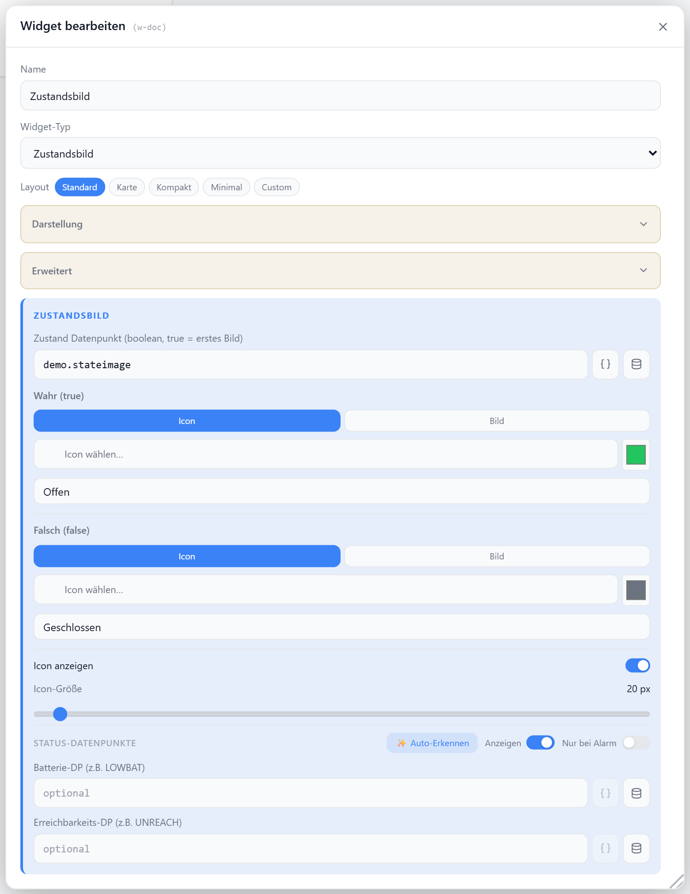

# Zustandsbild

Zeigt je nach Zustand eines `boolean`-Datenpunkts ein anderes Bild oder Icon — z. B. offene/geschlossene Tür, Bewegung erkannt/Ruhe. Für `true` und `false` lassen sich getrennt Icon, Farbe und Beschriftung festlegen.

## Datenpunkt

| Feld | Pflicht | Typ | |
| --- | --- | --- | --- |
| `datapoint` | ja | `boolean` | `true` zeigt die AN-Darstellung, sonst die AUS-Darstellung |

## Layouts

### Default
Icon/Bild mit Titel oben, Beschriftung darunter — für mittlere Zellen.

### Card
Vollflächige Karte mit Rahmen in der Zustandsfarbe, Bild und Beschriftung zentriert.

### Compact
Eine Zeile mit Bild, Titel und Beschriftungs-Pill — für Listen.

### Minimal
Nur Bild und große Beschriftung zentriert — für kleine Zellen.

### Custom
Bild, Titel und Beschriftung frei in einer Zellenmatrix platzieren — siehe [Custom-Layout](./custom-layout).

## Einstellungen

Alle Optionen werden im Editor unter **Widget bearbeiten** gesetzt.

### Anzeige

| Option | Standard | |
| --- | --- | --- |
| `showTitle` | `true` | Titel anzeigen |
| `showLabel` | `true` | Zustands-Beschriftung anzeigen |
| `showIcon` | `true` | Bild/Icon anzeigen |
| `iconSize` | `48` | px |
| `titleAlign` | `left` | `left` · `center` · `right` |

### Zustand AN (`true`)

| Option | Standard | |
| --- | --- | --- |
| `trueType` | `icon` | `icon` · `base64` |
| `trueIcon` | — | [Lucide-Icon](https://lucide.dev), nur bei `icon` |
| `trueColor` | `#22c55e` | Farbe für Icon und Beschriftung |
| `trueBase64` | — | Bilddaten/URL, nur bei `base64` |
| `trueLabel` | `Offen` | Beschriftung im AN-Zustand |

### Zustand AUS (`false`)

| Option | Standard | |
| --- | --- | --- |
| `falseType` | `icon` | `icon` · `base64` |
| `falseIcon` | — | [Lucide-Icon](https://lucide.dev), nur bei `icon` |
| `falseColor` | `#6b7280` | Farbe für Icon und Beschriftung |
| `falseBase64` | — | Bilddaten/URL, nur bei `base64` |
| `falseLabel` | `Geschlossen` | Beschriftung im AUS-Zustand |
